## Prerequisites
 - You have created a chatbot to deploy. This tutorial uses the bot created in the tutorial [Consume API Services and Call Webhooks from Your Chatbot](conversational-ai-webhook-api-call).

## Details
### You will learn
  - How to enable your chatbot within Microsoft Teams

This tutorial shows you how to enable and test your chatbot in Microsoft teams, but does not include information on adding the chatbot to teams and channels within Microsoft Teams. For more information on this, see [Manage your apps in the Microsoft Teams admin center](https://docs.microsoft.com/en-us/MicrosoftTeams/manage-apps).

---

[ACCORDION-BEGIN [Step 1: ](Create Microsoft Azure account)]

1. Create a trial account at [Microsoft Azure](https://azure.microsoft.com/en-in/free/).

2. After creating a trial account, make sure your subscription is set up properly.

    - Go to the Microsoft Azure [portal](https://portal.azure.com/).

    - Click **Subscriptions**.

    - Click your subscription (mine was called `Azure subscription 1`).

    - Click **Resource Providers** (menu on bottom left).

    Make sure the `microsoft.insights` is registered.

[DONE]
[ACCORDION-END]

[ACCORDION-BEGIN [Step 2: ](Create Azure bot channel)]
1. Go to the Microsoft Azure [portal](https://portal.azure.com/).

2. Click **Create a Resource**.

    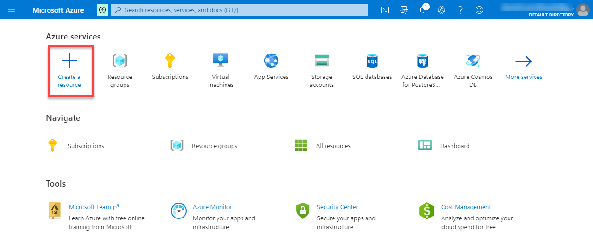

3. Search for and then select **Bot Channels Registration**.

    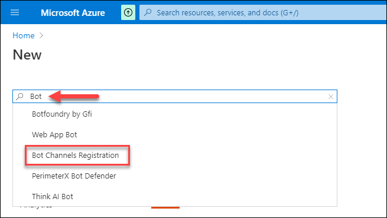

    Click **Create**.

    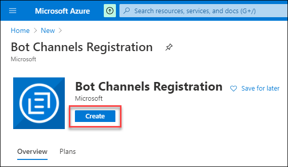

4. Fill in the registration form.

    

    | Field Name | Input Value
    |------------|-------------
    | Bot Name	 | A unique display name for the bot (which will appear in channels and directories -- this can be changed later)
    | Subscription	| Your Azure subscription	(in my trial, I had only one)
    | Resource Group	| Select a resource group. If you don't have one -- which you probably won't have -- then create a new one.
    | Location	| Choose a location near where your bot is deployed
    | Pricing Tier	| `F0	(10K Premium Messages)`
    | Messaging endpoint	| This will be filled out later
    | Application Insights	| On
    | Application Insights Location | Choose a location near where your bot is deployed

    Click **Create**.

>It may take a few minutes for the registration to take effect and be listed in your resources list.

[DONE]
[ACCORDION-END]

[ACCORDION-BEGIN [Step 3: ](Get your app ID and secret)]

1. Go to the Microsoft Azure [portal](https://portal.azure.com/), and then go to the **Dashboard**.

    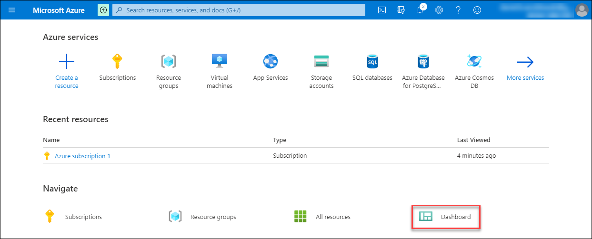

2. In the dashboard, click the resource you just created.

3. Click **Settings**, and scroll down.

    - Generate a **Client Secret** by clicking **Manage**, then **New Client Secret**, then **Add**.

    - Copy the **Microsoft App ID** and **Client Secret**, for use later.

    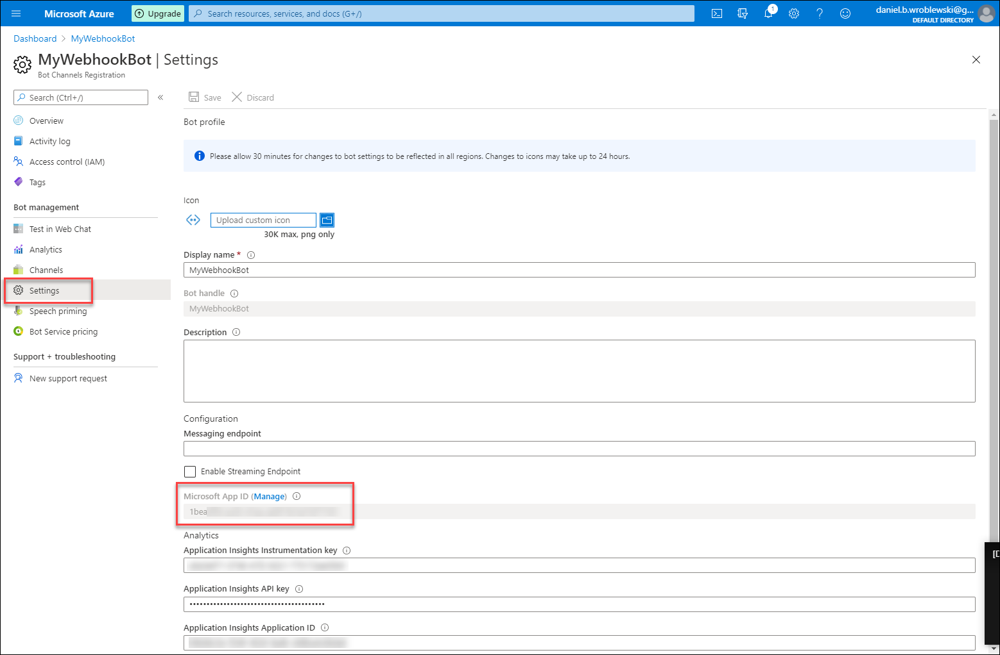

[DONE]
[ACCORDION-END]

[ACCORDION-BEGIN [Step 4: ](Connect bot to Azure)]

1. Go back to [SAP Conversational AI](https://cai.tools.sap/).

2. Open your bot, and go to the **Connect** tab.

    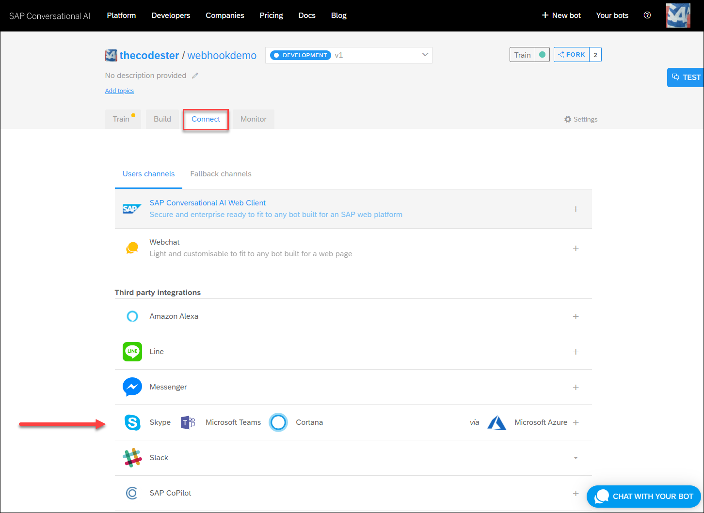

3. Click on the row for Skype and Teams, and in the popup, enter the app ID and client secret from Azure.

    

    An endpoint will be created. Copy it.

    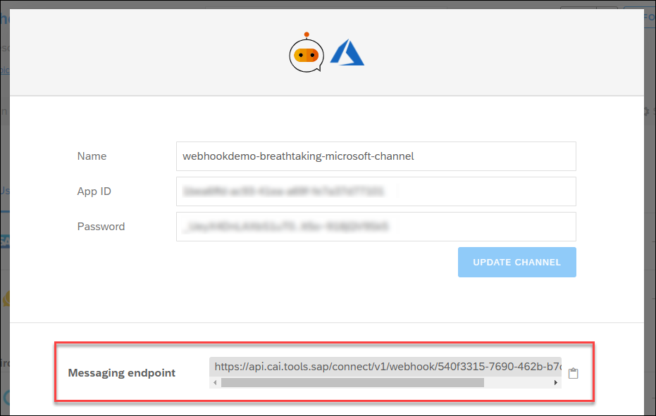

4. Go back to your resource in Azure, and under **Settings**, paste the endpoint into the **Messaging Endpoint** field.

    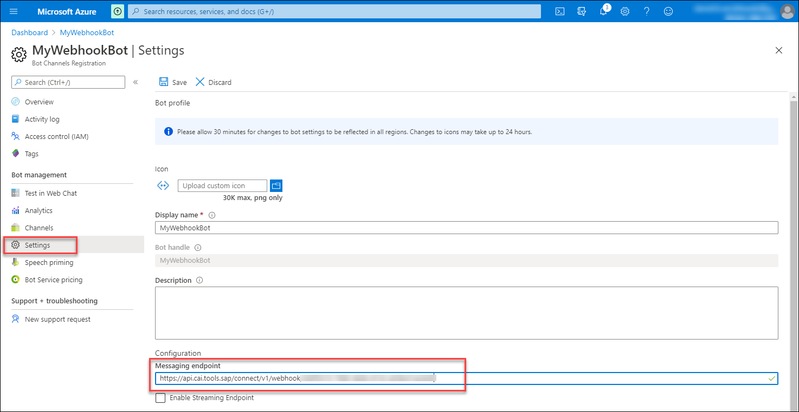

    Click **Save** (at top).

[DONE]
[ACCORDION-END]

[ACCORDION-BEGIN [Step 5: ](Test bot in Azure)]

1. Still in your resource in Azure, go to **Test in Web Client**.

    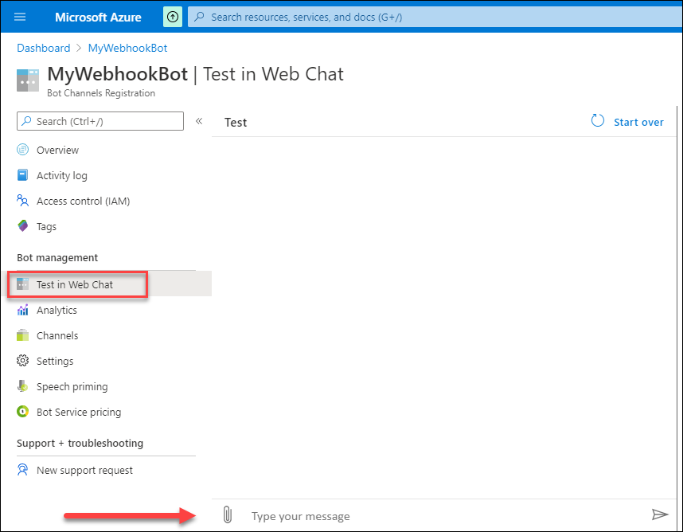

    At the bottom of the screen, there is a box for talking with your bot.

2. Test your bot.

    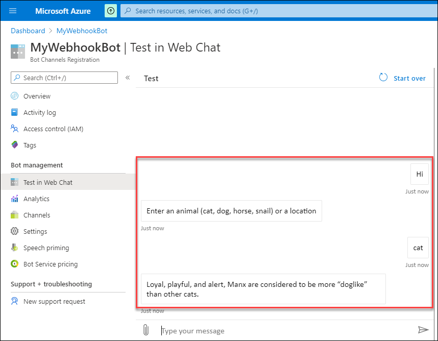

[DONE]
[ACCORDION-END]

[ACCORDION-BEGIN [Step 6: ](Test bot in Teams)]

1. Still in your resource in Azure, select **Channels**.

2. Click the Microsoft Teams icon.

    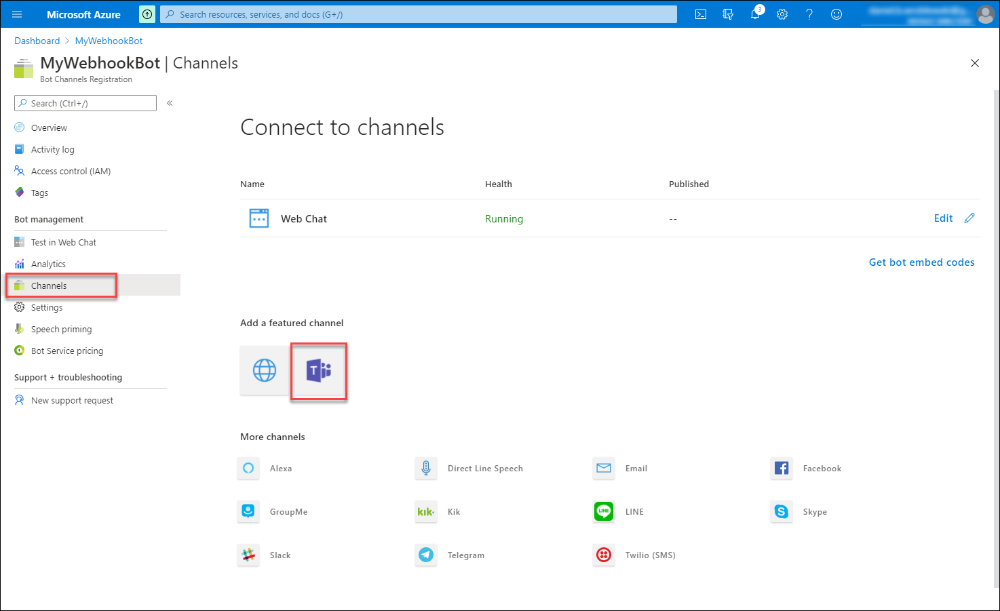

3. Click **Save**.

    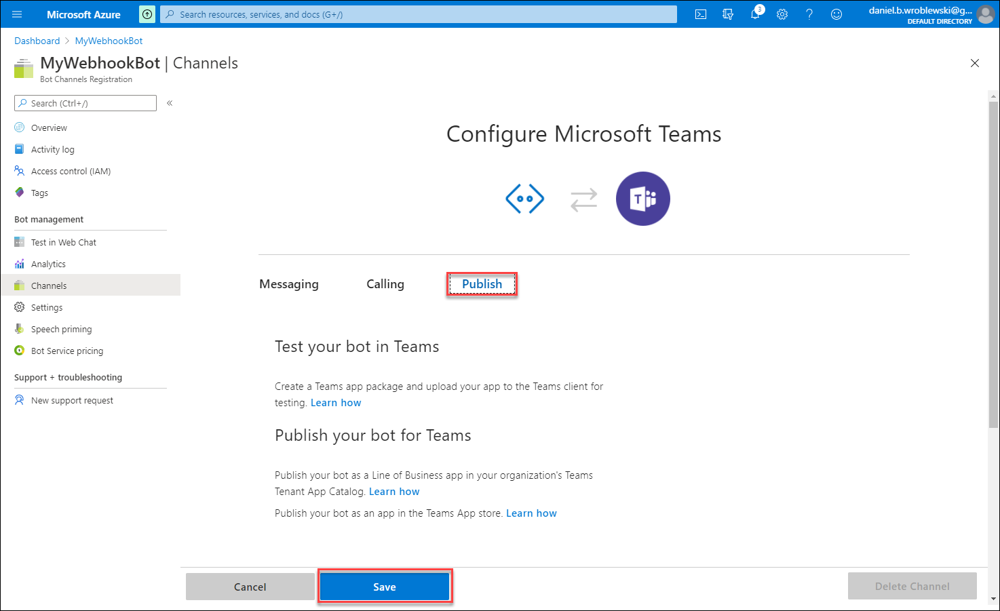

4. Navigate back to the **Channels** main page (you may have to navigate away or refresh the page).

5. Click on **Microsoft Teams** to open the Teams application.

    

6. Test your bot in the Teams application.

    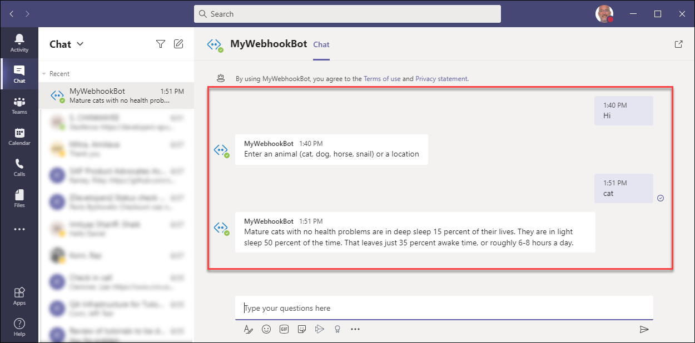

[DONE]
[ACCORDION-END]

[ACCORDION-BEGIN [Step 7: ](Test yourself)]

[VALIDATE_7]
[ACCORDION-END]

---

### Take It Further

- [Adding the bot as a Microsoft Teams app](https://docs.microsoft.com/en-us/microsoftteams/platform/bots/how-to/create-a-bot-for-teams)
- [Distributing a Microsoft Teams app](https://docs.microsoft.com/en-us/microsoftteams/platform/concepts/deploy-and-publish/overview)
