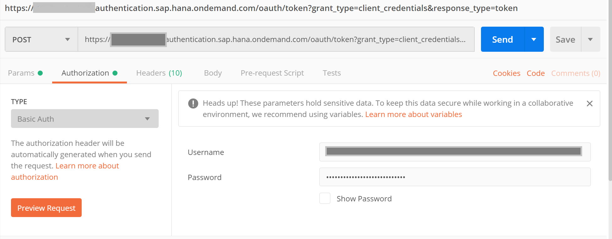
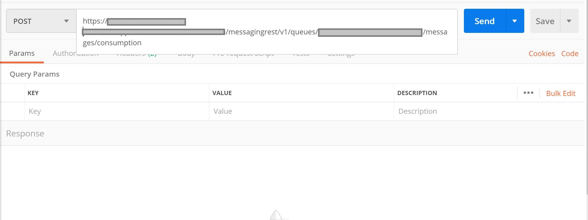

## Prerequisites
  - [Postman](https://www.getpostman.com/), API Development environment Tool is available to publish & receive message from queue using REST Protocol

## Details
### You will learn
  - Send and Receive message to and from a queue using Postman, a REST-based tool


---

[ACCORDION-BEGIN [Step 1: ](Configure postman)]

1. Open the Postman.

2. Click on "New" to open a new tab on Postman to work on.

    

3. Fetch the OAuth2.0 access token to be used for authorization on all subsequent operations in same session

    

4. Provide the **token endpoint URL** in Postman URL from the **Service Keys** for the protocol type HTTPREST.

    Build the postman URL by appending the `GRANTTYPE` as **CLIENTCREDENTIALS** and `RESPONSETYPE` as **token**

    So the final postman URL should look like this:

    ```URL
    https://<***space name***>
    .authentication.sap.hana.ondemand.com/oauth/token
    ?grant_type=client_credentials&response_type=token
    ```

    In the **Headers** tab, enter `Content-Type` as **KEY** and `application/x-www-form-urlencoded` as **VALUE**.

    

    In the **Authorization** tab, select the **Type** as `Basic Auth` from the dropdown.

      - In **Username**, provide the <`clientid`> value from the **Service Keys** for httprest protocol.
      - In **Password**, provide the <`clientsecret`> value from the **Service Keys** for httprest protocol.

      

    Select the **POST** option in **Postman** and click on the **Send** button. You will get the `access_token`.

[DONE]
[ACCORDION-END]

[ACCORDION-BEGIN [Step 2: ](Send message to the queue)]    

Open a new tab in the Postman.

  1. Build the postman URL as below
        https://<`uri` of the rest protocol based section from **Service Keys**>`/messagingrest/v1/queues/<Queue name>/messages`.
        `Queue name` is queue name along with the namespace. Replace the `/` present in the namespace with `%2f`while executing.  

  2. Open the **Headers** tab add below two key-value pairs.

    |       KEY      |                 VALUE                 |
    | :------------- | :------------------------------------ |
    |      x-qos     |                 0 or 1                |
    | authorization  | Bearer <the retrieved `access_token` >|     

    

  3. Open the **Authorization** tab and select the **TYPE** as `No Auth`.

    

  4. Open the **Body** tab and select the type as **raw**. And enter some test message in the body.

    

  5. Select the **POST** option in **Postman** and click on the **Send** button. If sending message is successful, you shall get a status as `204 No Content`.

[DONE]
[ACCORDION-END]

[ACCORDION-BEGIN [Step 3: ](Receive message from queue)]    

Open a new tab in the Postman.

  1. Build the postman URL as below
        https://< `uri` of the rest protocol based section from **Service Keys**>`/messagingrest/v1/queues/<Queue name>/messages/consumption`

  2. Open the **Headers** tab add below two key value pair.

    |       KEY      |                 VALUE                 |
    | :------------- | :------------------------------------ |
    |      x-qos     |                 0 or 1                |
    | authorization  | Bearer <the retrieved `access_token` >|     

    

  3. Open the **Authorization** tab and select the TYPE as **No Auth**.

    

  4. Open the **Body** tab and select the type as **raw**. And enter some test message in the body.

  5. Select the **POST** option in **Postman** and click on the **Send** button. If sending message is successful, you shall get a status as `200 OK`. And in the body tab you can view the message.

[VALIDATE_2]

[ACCORDION-END]


---
