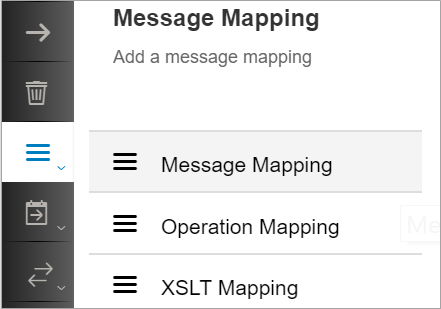
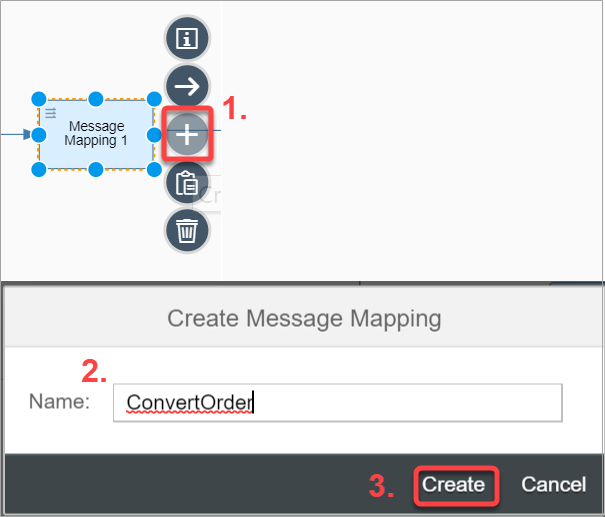
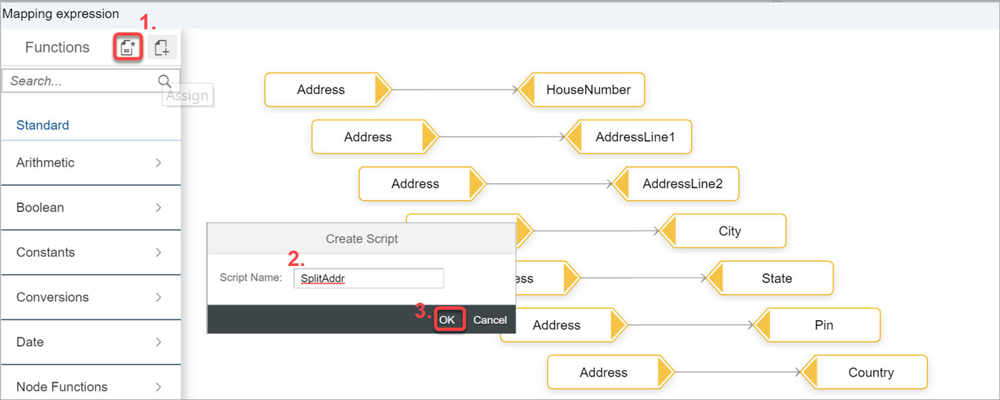
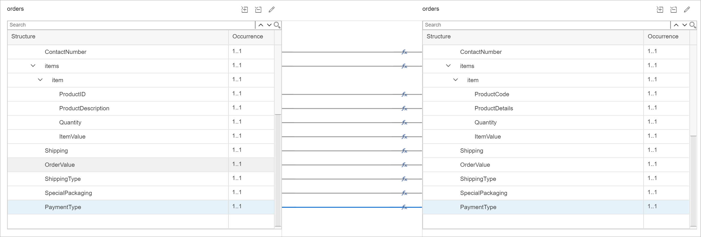
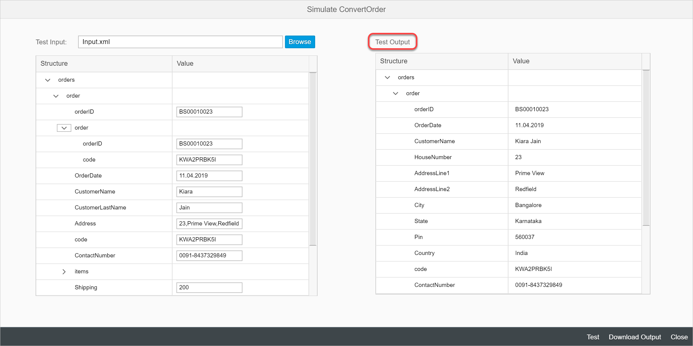
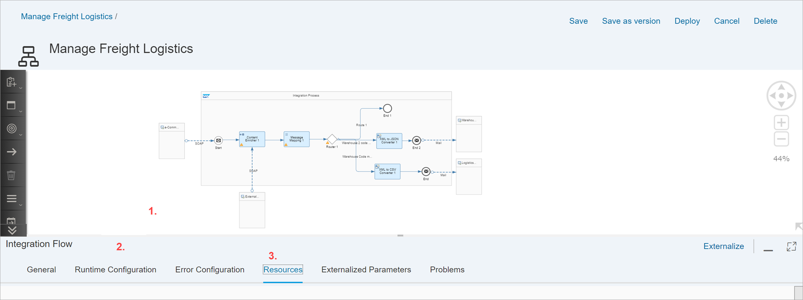

## Details
### You will learn
  - How to map message structures
  - How to use the visual mapping editor
  - How to use standard mapping functions
  - How to create a custom groovy function in Message mapping
  - How to create a custom function with multiple outputs
  - How to simulate mappings
  - How to work with resources


In this exercise, you shall convert the message structure from:

```XML
<orders>
	<order>
		<orderID>BS00010023</orderID>
    <order>
  		<orderID>BS00010023</orderID>
      <code>KWA2PRBK5I</code>
    </order>  
		<OrderDate>11.04.2019</OrderDate>
		<CustomerName>Kiara</CustomerName>
		<CustomerLastName>Jain</CustomerLastName>
		<Address>23,Prime View,Redfield,Bangalore,Karnataka,560037,India</Address>
    <code>KWA2PRBK5I</code>
		<ContactNumber>0091-8437329849</ContactNumber>
		<items>
			<item>
				<ProductID>RPD4044543</ProductID>
				<ProductDescription>Wireless Mouse</ProductDescription>
				<Quantity>1</Quantity>
				<ItemValue>1057</ItemValue>
			</item>
		</items>
		<Shipping>200</Shipping>
		<OrderValue>1257</OrderValue>
		<ShippingType>Priority 2-day</ShippingType>
		<SpecialPackaging>None</SpecialPackaging>
		<PaymentType>CoD</PaymentType>
	</order>
</orders>
```

to:

```XML
<orders>
	<order>
		<orderID>BS00010023</orderID>
		<OrderDate>11.04.2019</OrderDate>
		<CustomerName>Kiara Jain</CustomerName>
    <HouseNumber>23</HouseNumber>  
    <AddressLine1>Prime View</AddressLine1>
    <AddressLine2>Redfield</AddressLine2>
    <City>Bangalore</City>  
    <State>Karnataka</State>  
    <Pin>560037</Pin>  
    <Country>India</Country>  
    <code>KWA2PRBK5I</code>
		<ContactNumber>0091-8437329849</ContactNumber>
		<items>
			<item>
				<ProductCode>RPD4044543</ProductCode>
				<ProductDetails>Wireless Mouse</ProductDetails>
				<Quantity>1</Quantity>
				<ItemValue>1057</ItemValue>
			</item>
		</items>
		<Shipping>200</Shipping>
		<OrderValue>1257</OrderValue>
		<ShippingType>Priority 2-day</ShippingType>
		<SpecialPackaging>None</SpecialPackaging>
		<PaymentType>CoD</PaymentType>
	</order>
</orders>
```


---

[ACCORDION-BEGIN [Step 1: ](Add message mapping)]
1. Add a Message Mapping step to message processing pipeline:
    * Click on the design Palette.
    * Choose __Mapping__.
    * Choose __Message Mapping__.

    

    * Drag it on to the execution pipeline after the __Content Enricher__.

    

    * Select the mapping step and click on __Create__.

    

    * In the pop-up dialog, enter `ConvertOrder` and click __Create__.

    

    * Right-click the [Source XSD File](https://raw.githubusercontent.com/SAPDocuments/Tutorials/master/tutorials/cp-integration-convert-message-structure/Source.xsd) and [Target XSD file](https://raw.githubusercontent.com/SAPDocuments/Tutorials/master/tutorials/cp-integration-convert-message-structure/Target.xsd) links and save them on your local folder. You will need them for the next steps.

    * On the following screen, upload the source and target XSD into your message map:

        * Click on **Add source message**.
        * Click **Upload from File System** in the next window.
        * Choose the file from the location where you saved the files before you started the exercise.
        * Repeat the above steps for the target message structure.

    * You should get the following screen:

    

    * Map the following fields one-to-one by dragging a field from the source to the corresponding field on the target:

        * `orders`
        * `order`
        * `orderID`
        * `OrderDate`
        * `ContactNumber`
        * `items`
        * `item`
        * `Quantity`
        * `ItemValue`
        * `Shipping`
        * `OrderValue`
        * `ShippingType`
        * `SpecialPackaging`
        * `PaymentType`

        

    * Map the following fields:

        | Source | Target     |
        | :------------- | :------------- |
        | `ProductID`      | `ProductCode`       |
        | `ProductDescription` | `ProductDetails` |


[DONE]
[ACCORDION-END]

[ACCORDION-BEGIN [Step 2: ](Use Standard functions)]

1. Link `CustomerName` on the source to `CustomerName` on the target.

2. Link `CustomerLastName` on the source also to `CustomerName` on the target.

3. Go to the visual mapping editor and look for the `Concat` standard function and drag it to the work area.

4. Connect the following:       

    `concat` → `CustomerName`

    `CustomerName` → `string1`

    `CustomerLastName` → `string2`

    `Delimiter string` → space

    

[DONE]
[ACCORDION-END]


[ACCORDION-BEGIN [Step 3: ](Create a custom function with multiple output)]

1. Connect __Address__ on the source to the following fields on the target:

    * `HouseNumber`
    * `AddressLine1`
    * `AddressLine2`
    * `City`
    * `State`
    * `Pin`
    * `Country`

    

2. Go to visual editor at the bottom and click on __Create__ function.

3. In the pop-up dialog, give `SplitAddr` as the __Script Name__ and click __OK__.

    

4. Paste the following code in the script file:

    ```Groovy
    def void splitAddress(String[] Address, Output HouseNumber, Output AddressLine1, Output AddressLine2, Output City, Output State, Output Pin, Output Country)
    {
        String Addr = Address[0];
        def splitAddr = Addr.split(',');
        HouseNumber.addValue(splitAddr[0]);
        AddressLine1.addValue(splitAddr[1]);
        AddressLine2.addValue(splitAddr[2]);
        City.addValue(splitAddr[3]);
        State.addValue(splitAddr[4]);
        Pin.addValue(splitAddr[5]);
        Country.addValue(splitAddr[6]);
    }
    ```

5. Click __OK__.

    

6. Click on __Add__ functions.

7. Choose **`splitAddr.groovy`** in the pop-up dialog.

8. You will now see `splitAddr` added to the list of custom functions under the standard functions:

    

9. Click on `splitAddr` and drag the function `splitAddress` to the visual editor and connect the relevant fields.

Finally, you should see the following:

  

Once all the fields are mapped, your mapping should look like:




[DONE]
[ACCORDION-END]

[ACCORDION-BEGIN [Step 4: ](Simulate mapping)]

You will now use the __Simulate__ functionality to test if the mapping is configured correctly and the desired output is generated.

Store the [Input Message](https://sap-my.sharepoint.com/:u:/p/meghna_shishodiya/EfVlE7h0-sJHgj4qiBH9ZakBnu2Pqx6oERvlFjxtwGXwhw?e=MKsQkO) to you file system.

1. Click on __Simulate__.

2. Click on __Browse__ and import the __Input Message__.

    

3. Click on __Test__.

    

4. After the system executed the test, the system generated the output on the left side of the screen:

    

5. Validate the result to check if it is as expected. Make the necessary changes if needed.

6. Once you are satisfied with the results, click on __OK__ to return back to the integration flow:

    

[DONE]
[ACCORDION-END]

[ACCORDION-BEGIN [Step 5: ](Explore resources)]

In the process of defining a message map, you created or uploaded a lot of artifacts, like **XML**, **XSD**, scripts and message maps.

You can find each of the artifacts under the __Resources view__.

1. Click on the __Canvas__.

2. Go to the __Properties Sheet__.

3. Go to the __Resources__ tab.

    

4. You can find all the artifacts that belong to the integration flow listed here.

    > You can upload an artifact once and reuse it multiple times in the same integration flows.

    

[VALIDATE_1]

[ACCORDION-END]

---
