## Details
### You will learn
- How to implement a logic in a card

Handlebars helper help developer to use JavaScript logic in rendering of the card.

---

[ACCORDION-BEGIN [Step 1: ](Get familiar with real world use case)]

A Company wants managers to have a set of `KPIs` available on a mobile device. In order to simplify the card, sales order status is visualized with the traffic lights ( **Accepted** | Green, **Rejected** | Red and **New** | Yellow) and also if the gross amount is larger than 500 Euros then it is highlighted with Green yellow color.

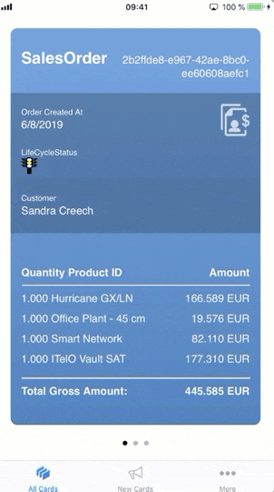

[DONE]
[ACCORDION-END]

[ACCORDION-BEGIN [Step 2: ](Create a new card)]

Make sure you have logged into the **SAP Cloud Platform Mobile Services cockpit**. Navigate to **SAP Mobile Cards** to look into Mobile Cards configuration.


Click the **Create a New Card** icon.

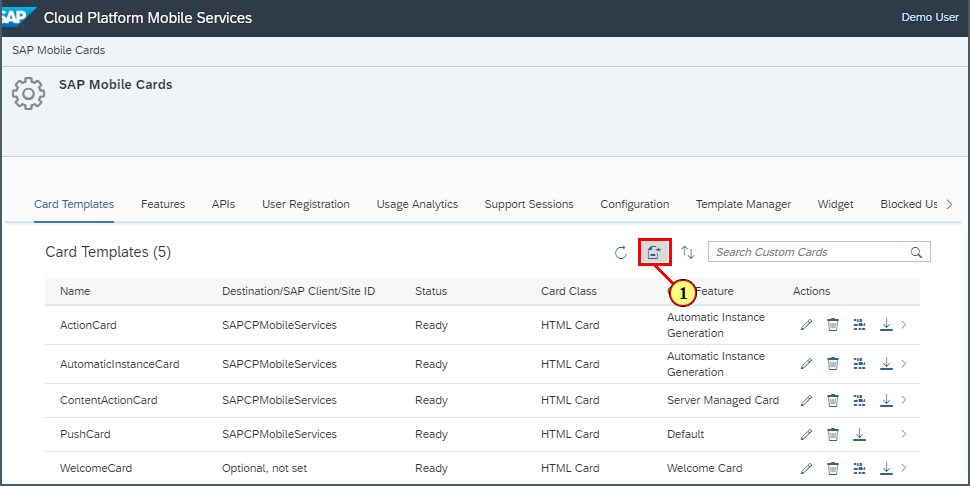

Provide the required information:

| Field | Value |
|----|----|
| **Name** | `HandlebarHelperCard` |
| **Destination** | `com.sap.edm.sampleservice.v2` |
| **Template Source** | `Template Manager` |
| **HTML Template** | `Sample Sales Orders Template` |

> If you see a pop-up, click **OK** for the confirmation.

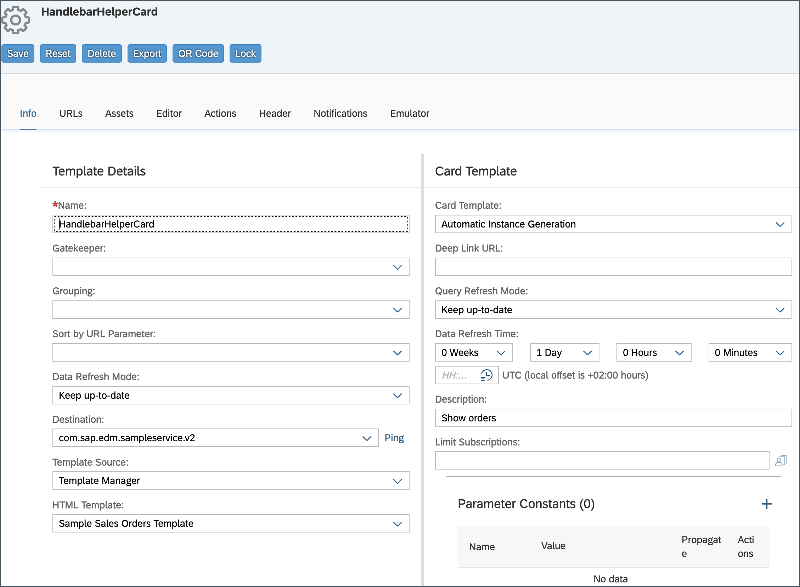

[DONE]
[ACCORDION-END]

[ACCORDION-BEGIN [Step 3: ](Insert JSON keys into handlebars)]

Click **Editor** to view the **HTML** which builds this card and to add handlebars classes.

Make sure **Define source without mapping** is checked, here the actual mapping of the data is defined.

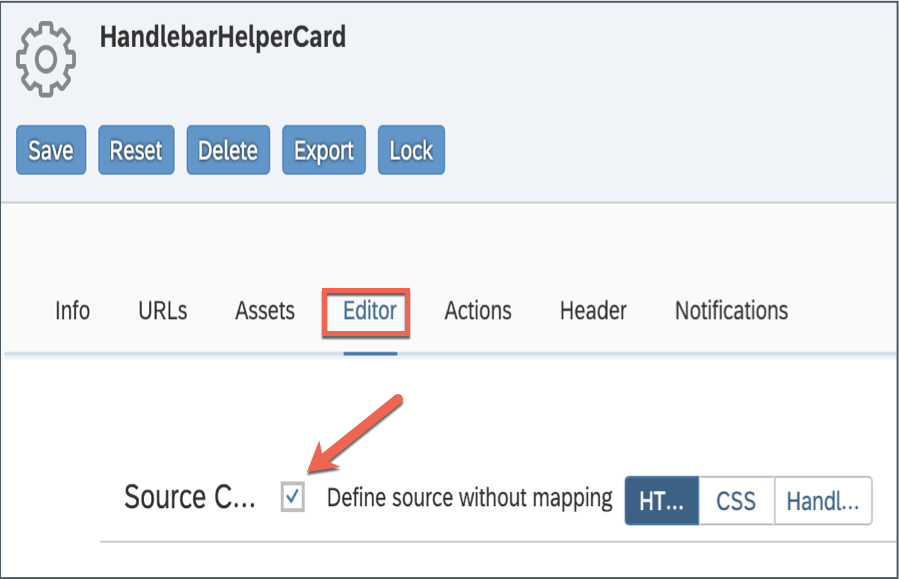

>In this template, there is already a **d.** added in front of  [Handlebars](https://handlebarsjs.com) expression and this expression points to the correct JSON path.

>

Scroll down and you will find [Handlebars block helper](https://handlebarsjs.com/guide/#evaluation-context) function **each**, it points to the correct JSON path of the items result set.

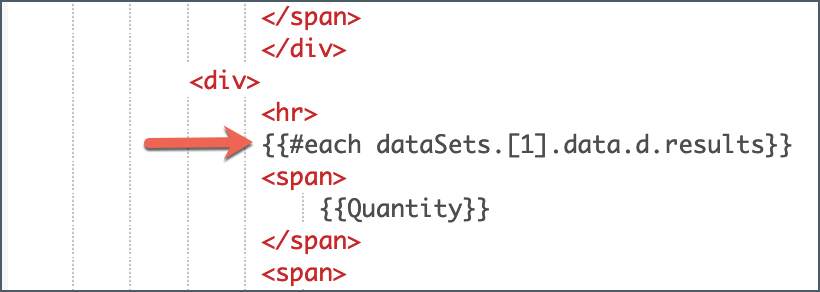

Replace `{{dataSets.[0].data.d.LifeCycleStatusName}}` with `{{lcsHelper dataSets.[0].data.d.LifeCycleStatusName}}` handlebar helper function.

```JSON
{{lcsHelper dataSets.[0].data.d.LifeCycleStatusName}}
```


You will see a pop-up window alerting on missing helper function. Click **Close** to implement it.


>We have not yet implemented `lcsHelper` function.

Click **Handle...** to switch to the **Handlebars** tab where missing Handlebars helper function can be implemented.


Replace existing source code with below.

```JavaScript
Handlebars.registerHelper("lcsHelper", function (passedString) {
if (passedString.includes("A")) {
return new Handlebars.SafeString( "");
}
if (passedString.includes("R")) {
return new Handlebars.SafeString("");
}
return new Handlebars.SafeString( "");
});
```

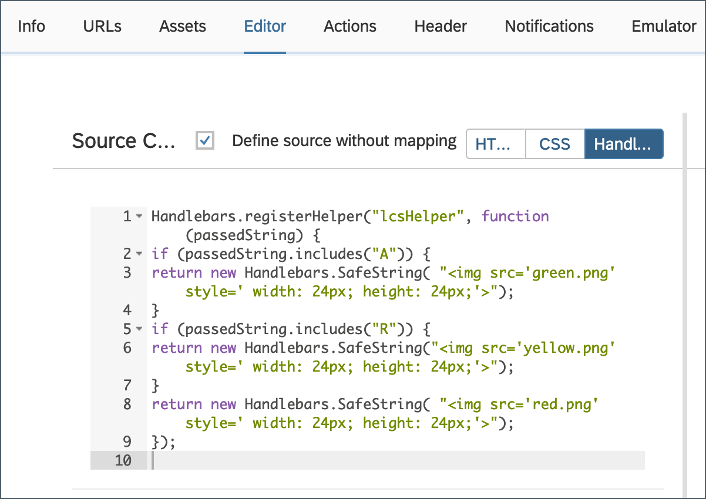

>This Handlebars helper function will evaluate the `passedString` which is the `LifeCycleStatusName` JSON value. This function will insert an image depending on the status and return the related `HTML` snippet. If the Status is **C** (closed) than the function will not insert any image.

[VALIDATE_1]
[ACCORDION-END]

[ACCORDION-BEGIN [Step 4: ](Upload assets to the card)]

Open below links and save images on local machine. These images will be used as assets for this tutorial.

[Yellow Traffic light](http://res.publicdomainfiles.com/pdf_view/65/13548535818149.png)

[Green  Traffic light](http://res.publicdomainfiles.com/pdf_view/65/13548534013334.png)

[Red Traffic light](http://res.publicdomainfiles.com/pdf_view/65/13548529215849.png)

>In this tutorial, image files were saved as green.png, yellow.png and red.png.

Once done, click **Assets** to upload asset files.


Click the **upload** icon to upload the images.

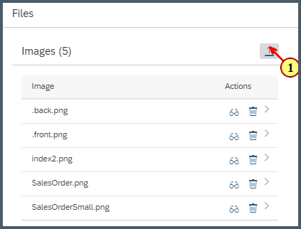

Navigate to folder where you have saved all three images and upload them one by one.


Make sure you have all three images uploaded.

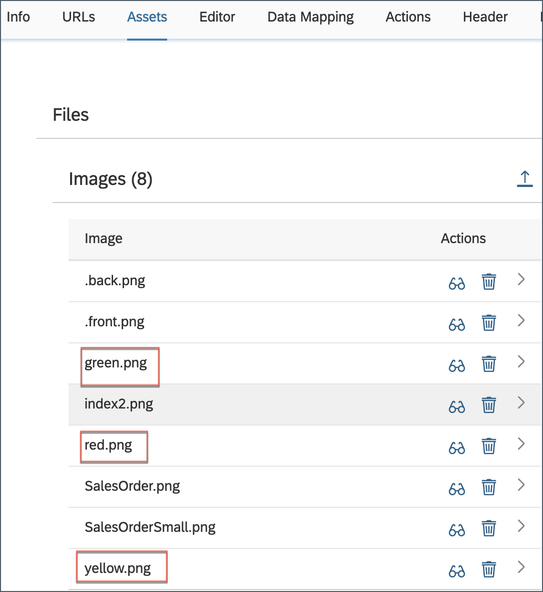

[DONE]
[ACCORDION-END]

[ACCORDION-BEGIN [Step 5: ](Implement logic for gross amount)]

Navigate to **Editor** tab and click **Handle...**.


Copy and paste the following code below the existing function:

```JavaScript
Handlebars.registerHelper("gaCheckHelper", function (grossAmount) {
if (grossAmount > 500) {
return new Handlebars.SafeString( "<b> <font color=\"GreenYellow\">" + grossAmount + "</b> </font>");
}
return new Handlebars.SafeString( grossAmount);
});
```

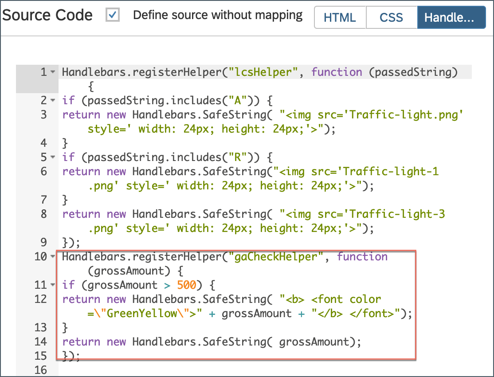

>This handlebars helper function will evaluate the  `grossAmount` which is the `grossAmount` JSON value. If the value is above 500 it will Color it green.

Switch to **HTML** editor.


Replace `{{GrossAmount}}` with `{{gaCheckHelper GrossAmount}}` .

```JSON
{{gaCheckHelper GrossAmount}}
```

>

>`gaCheckHelper` handlebars helper function is getting the value `GrossAmount` passed in. `GrossAmount` does not need the path as this function is getting called in the Handlebars helper block with `d.Items.results` path.

As a result, the value above 500 is coloured green.

>If the editor does not refreshed by itself, you can force it to reload by switching tabs. Click `css` and then back on `HTML`.

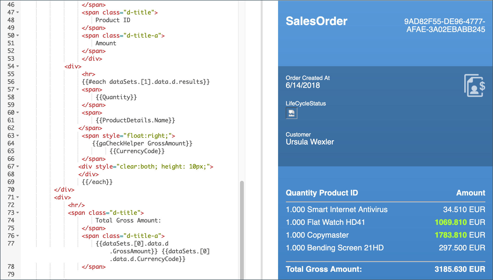

Click **Save**.

[DONE]
[ACCORDION-END]

[ACCORDION-BEGIN [Step 6: ](Subscribe to the card)]

In the SAP Mobile Cards application, click **More** | **Subscriptions**.

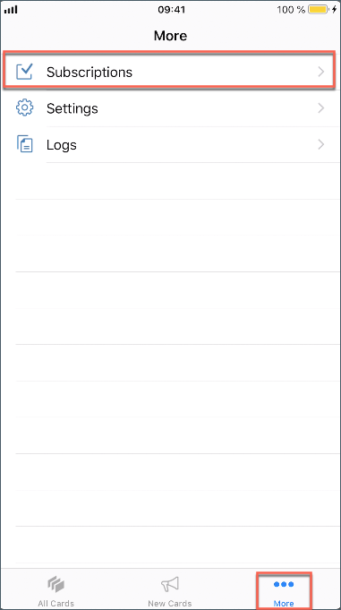

Click `HandlebarsHelperCard` under the **All** tab.

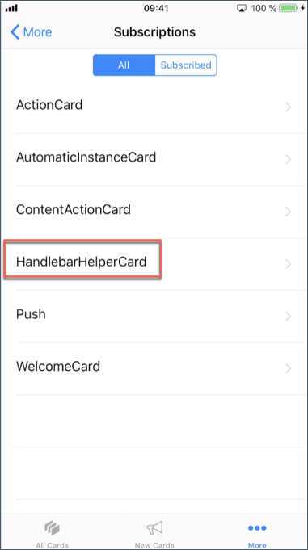

Click **Subscribe** to activate the `HandlebarsHelperCard` subscription.

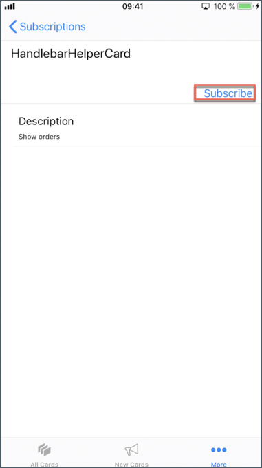

Click **All Cards** or **New Cards** to view this card.


Congratulations, you have successfully implemented handlebars helper in your card.

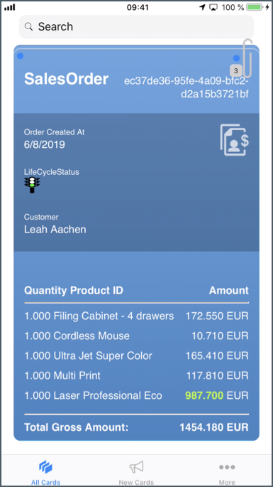

>These helpers are only called when the card is updating, this means, if there is no change in data the handlebar functions are not going to be called.

[DONE]
[ACCORDION-END]
