## Prerequisites
- **Tutorial group:** [Set Up for the Mobile Development Kit (MDK)](group.mobile-dev-kit-setup)
- **Download and install:** **SAP Mobile Services Client** on your [iOS](https://apps.apple.com/us/app/sap-mobile-services-client/id1413653544) or [Android](https://play.google.com/store/apps/details?id=com.sap.mobileservices.client) device (If you are connecting to `AliCloud` accounts then you will need to brand your [custom MDK client](cp-mobile-dev-kit-build-client) by whitelisting custom domains as allowed domains restrictions that exist by default in App store clients.)

## Details
### You will learn
  - How to retrieve OData annotations for Products in Mobile Services sample OData service
  - How to create a fully functional Mobile app

You may clone an existing project from [GitHub repository](https://github.com/SAP-samples/cloud-mdk-tutorial-samples/tree/master/4-Level-Up-with-the-Mobile-Development-Kit/5-Use-OData-Annotations-to-Add-CRUD-Functionality-to-an-MDK-App) and start directly with step 5 in this tutorial but make sure you complete step 2.

---

Mobile Development Kit brings OData annotations capabilities to your native mobile applications. MDK editor supports generating List-Detail pages based on annotations. List-Detail pages are similar to a Master-Detail page, but it is two pages instead of one. The MDK editor parses existing annotations to give you a huge leap forward in your native mobile application.

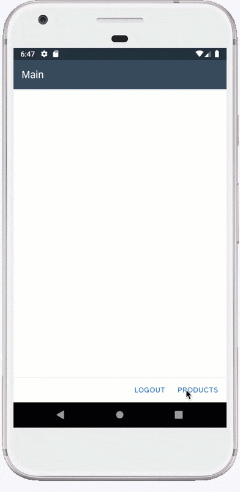

[ACCORDION-BEGIN [Step 1: ](Understand the SAP Fiori Elements)]

If you are a Fiori app designer, you may already be familiar with OData annotations and smart templates.

SAP Fiori elements provide designs for UI patterns and predefined templates for common application use cases. App developers can use SAP Fiori elements to create SAP Fiori applications based on OData services and annotations. With little or no coding, you can create SAP Fiori applications. UI5 has a Web solution, named smart templates, that builds a starter application by parsing the annotations in your OData service.

You can also check out more information on the Fiori elements [List Report](https://experience.sap.com/fiori-design-ios/article/list-report/) and [Smart templates](https://experience.sap.com/fiori-design-web/smart-templates/)

[DONE]
[ACCORDION-END]

[ACCORDION-BEGIN [Step 2: ](Add annotation information in the backend destination)]

Sample backend in SAP Cloud Platform Mobile Services provides annotation functionality for **Products**. If you add annotation path in given backend endpoint, the same annotation information can be leveraged by MDK editor to generate related CRUD pages.

Make sure you have already configured an app in Mobile Services cockpit and have added Sample service as per step 3 in [this](cp-mobile-dev-kit-ms-setup) tutorial.

As admin changes to the default sample service destinations (`com.sap.edm.sampleservice.v2` and `com.sap.edm.sampleservice.v4`) are not allowed, you need to copy the destination URL from the sample service destination `com.sap.edm.sampleservice.v2` and create a new destination with the new name e.g., `com.sap.mdk.annotation` and add the required annotations.

1. In SAP MDK Demo App configuration, click **Mobile Connectivity**.

    !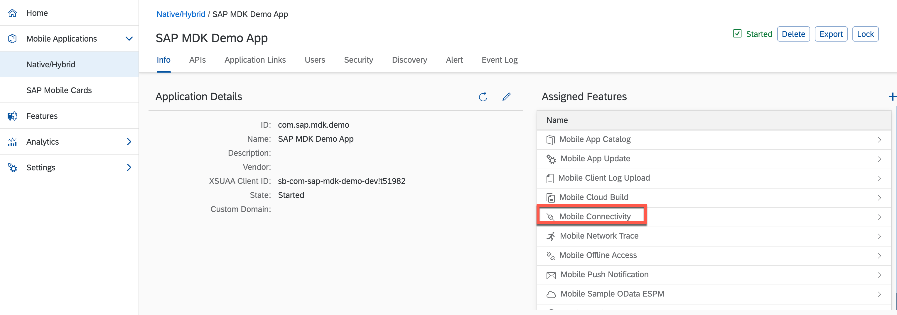

2. Copy the destination URL from the sample service destination `com.sap.edm.sampleservice.v2`.

    !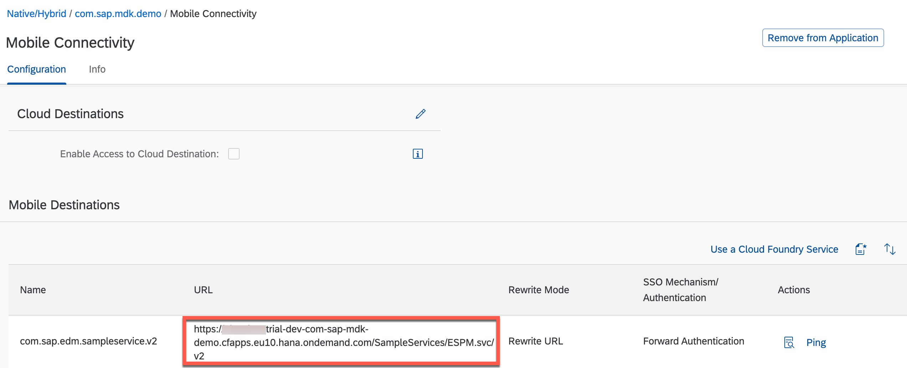

3. Click create icon to create a new destination.

    !

4. Enter a new destination name `com.sap.mdk.annotation` and paste the URL. Click **Next**.

    !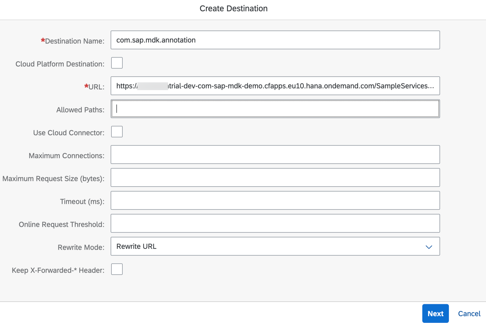

5. For this tutorial, there is no Custom Headers required, click **Next**.

    !

6. Click **Add Annotation URL** to add OData Annotations to the Sample service.

    !

    Provide the below information and click **Next**:

    | Field | Value |
    |----|----|
    | `Annotation Name`| `Product` |
    | `Path/File` | `/annotations/Products` |

    !

7. In **Create Destination** screen, select **SSO Mechanism** as `Forward Authentication` and click **Next**.

    !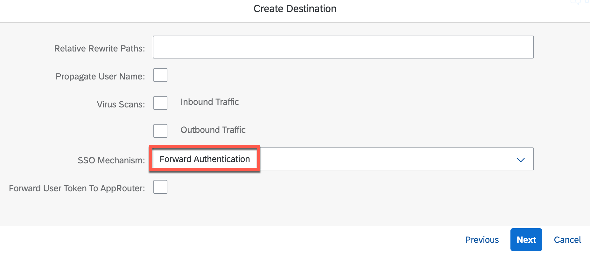

9. In the following screen, let the default settings as it is. Click **Finish**.

    !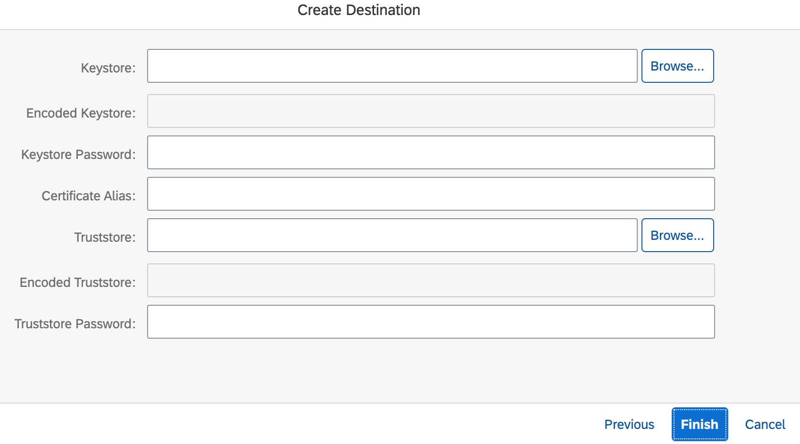

    You should see a Toast Message **Destination Created** at bottom of the page.

    Here you can see that OData Annotation information is available in the new destination.

    !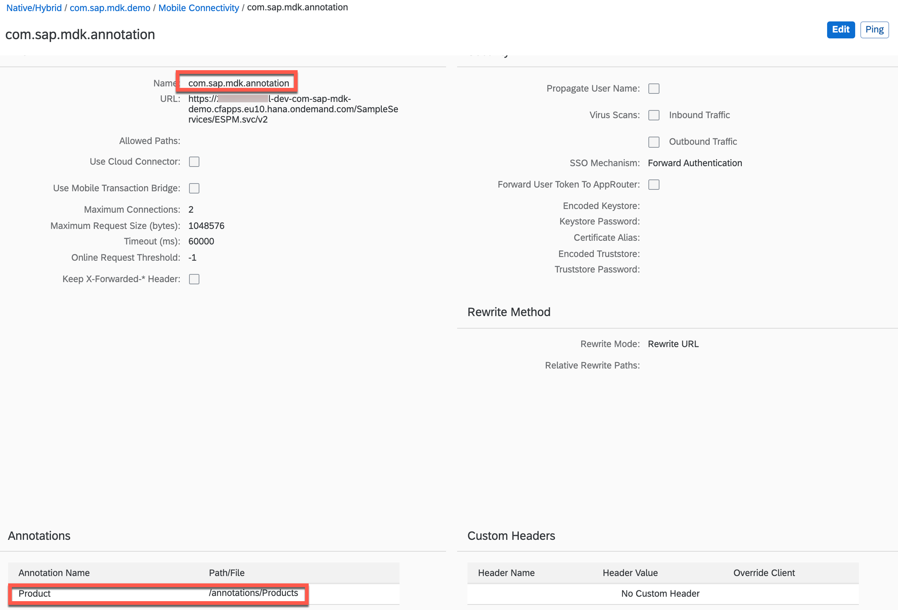

[DONE]
[ACCORDION-END]

[ACCORDION-BEGIN [Step 3: ](Create a new MDK project in SAP Business Application Studio)]

This step includes creating the mobile development kit project in the editor.

1. Launch the [Dev space](cp-mobile-bas-setup) in SAP Business Application Studio.

2. Navigate to *File* menu &rarr; click **New Project from Template**.

    !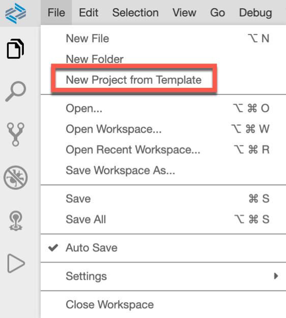

3. Select **MDK Project** and click **Next**.

    !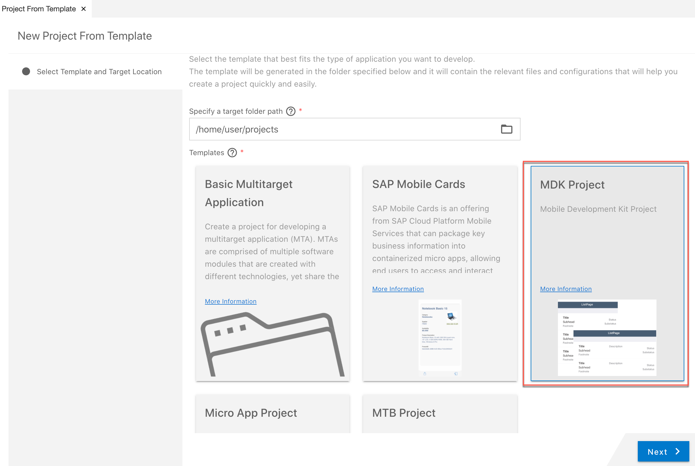  

4. In *Basic Information* step, select or provide the below information and click **Next**:

    | Field | Value |
    |----|----|
    | `MDK template type`| Select `Base` from the dropdown |
    | `Your project name` | `MDK_Annotations` |
    | `Your application name` | <default name is same as project name, you can provide any name of your choice> |

    !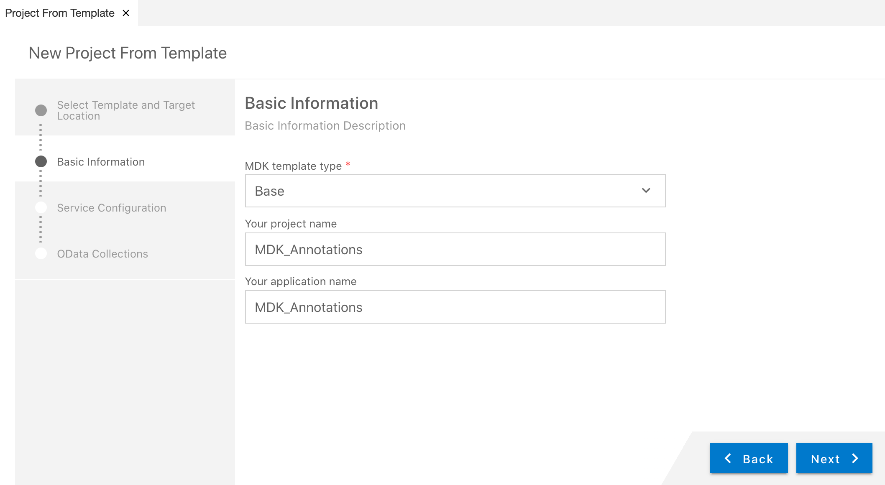

    >More details on _MDK template_ is available in [help documentation](https://help.sap.com/doc/f53c64b93e5140918d676b927a3cd65b/Cloud/en-US/docs-en/guides/getting-started/mdk/bas.html#creating-a-new-project-cloud-foundry).  

    >If you see *Cloud foundry token expired, continue without mobile services connection?* message, then set the Cloud Foundry environment again by clicking at bottom left corner of your status bar to initiate a valid session and repeat above steps.      

5. In *Service Configuration* step, provide or select the below information and click **Next**:

    | Field | Value |
    |----|----|
    | `Service File Name`| `<Provide any name of your choice>` |
    | `OData Source` | Select `Mobile Services` from the dropdown |
    | `Application Id` | Select `com.sap.mdk.demo` from the dropdown |
    | `Destination` | Select `com.sap.mdk.annotation` from the dropdown |
    | `Enter a path to the OData service` | Leave it as it is |
    | `Language URL` | Leave it with the default value |
    | `Enable Offline` | Choose `No` |   

    !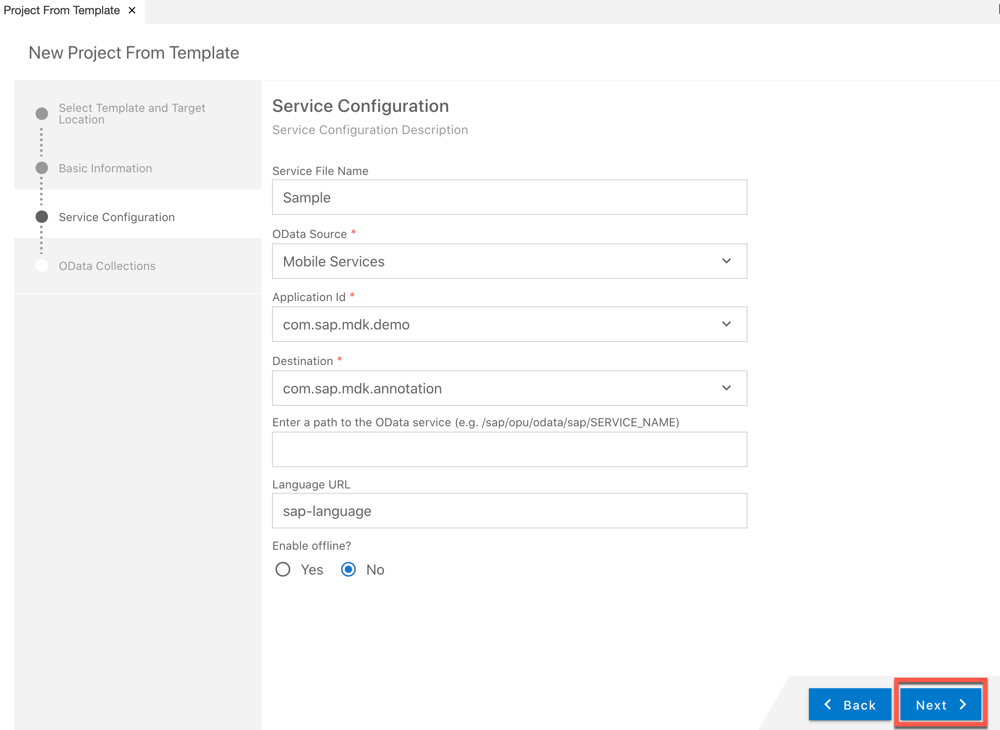

    Regardless of whether you are creating an online or offline application, this step is needed app to connect to an OData service. When building an Mobile Development Kit application, it assumes the OData service created and the destination that points to this service is setup in Mobile Services and SAP Cloud Platform.

    Since you will create an online based app, hence _Enable Offline Store_ option is unchecked.

6. After clicking **Next**, the wizard will generate your MDK Application based on your selections. You should now see the `MDK_Annotations` project in the project explorer. As you have already opened the workspace, there is no need to open the generated project in a new workspace. Ignore the pop-up or click the cross icon to hide the window.

    !

[DONE]
[ACCORDION-END]

[ACCORDION-BEGIN [Step 4: ](Add MDK Annotation component to MDK project)]

1. Right-click `Application.app` and select **MDK:New MDK Annotation Component**.

    !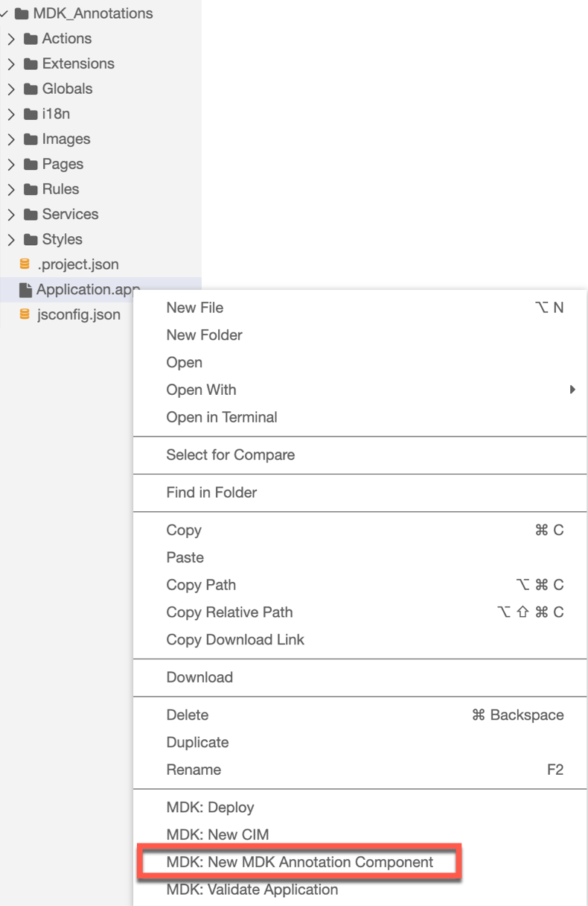

2. MDK editor fetches annotation details, select **Product** Annotation and click **Next**.

    !

3. In **Template Customization** step, click **Next**.

    !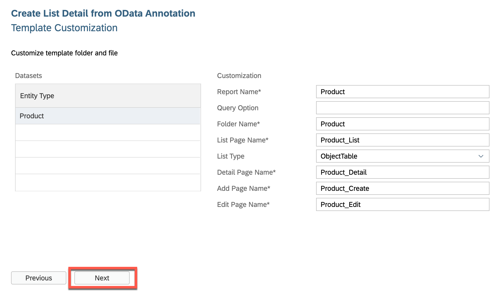

4. Click **Finish** to create list detail from OData Annotation.

    !

    In MDK project, you will see new pages, actions, rules have been generated for **Product**.

    !

5. Next, you will add a Toolbar item on `Main.page` to navigate to `Product_List.page`.

    In `Main.page`, drag and drop **Toolbar Item** control on the page.

    !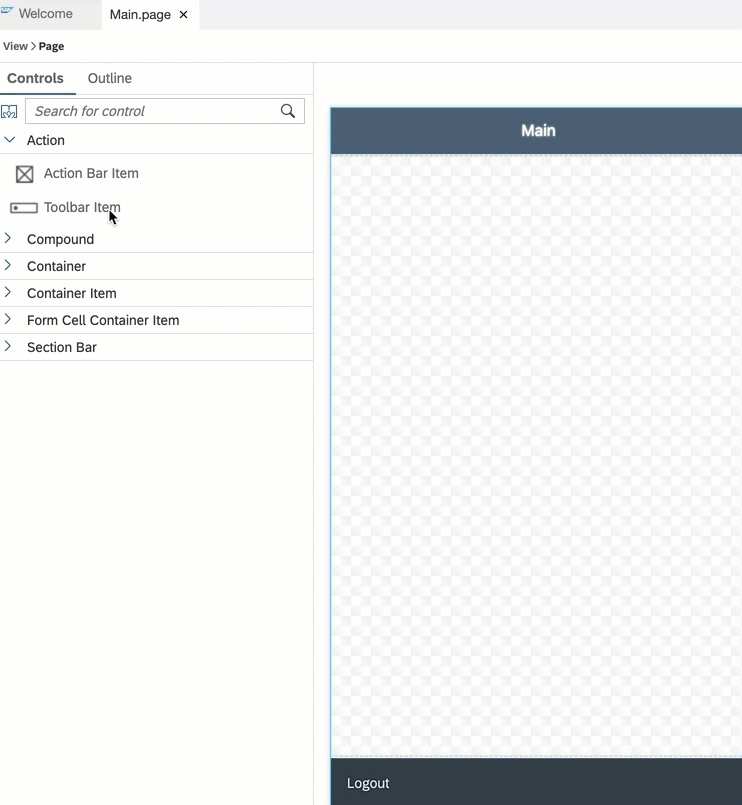

6. Change its **Caption** to **Products**.

    !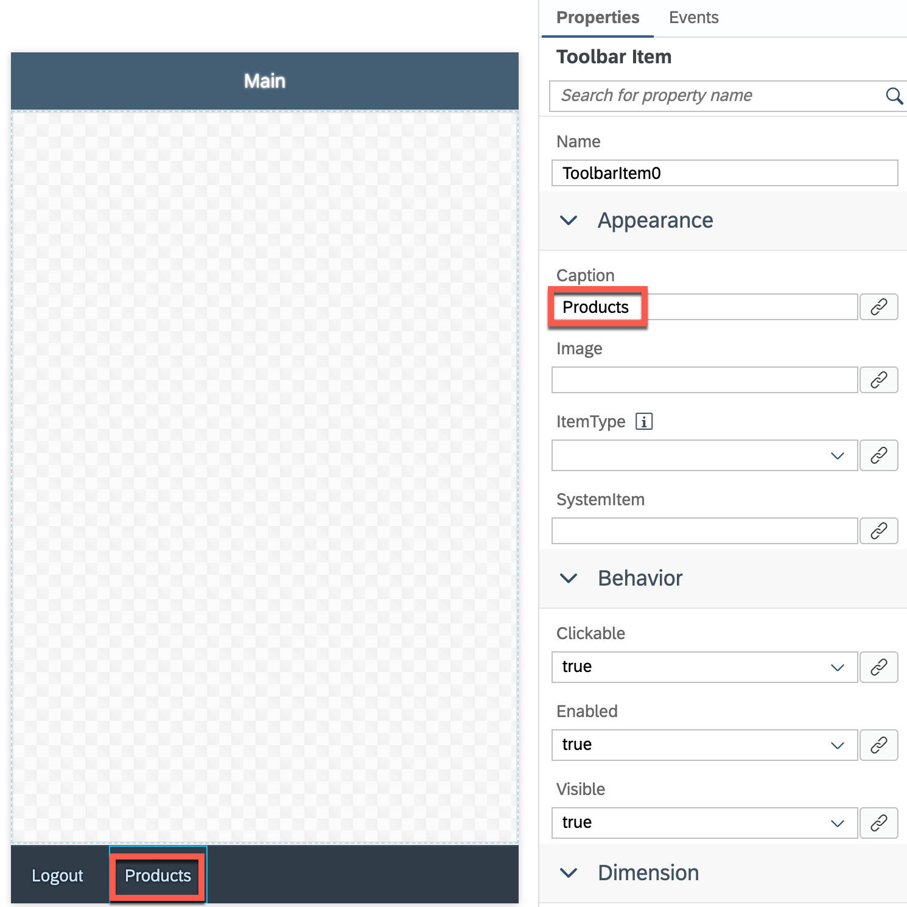

7. Now, you will set the `onPress` event to `NavToProduct_List.action`.

    In **Events** tab, click the **link icon** for the `OnPress` property to open the object browser.

    Double-click the `NavToProduct_List.action` and click **OK** to set it as the `OnPress` action.

    !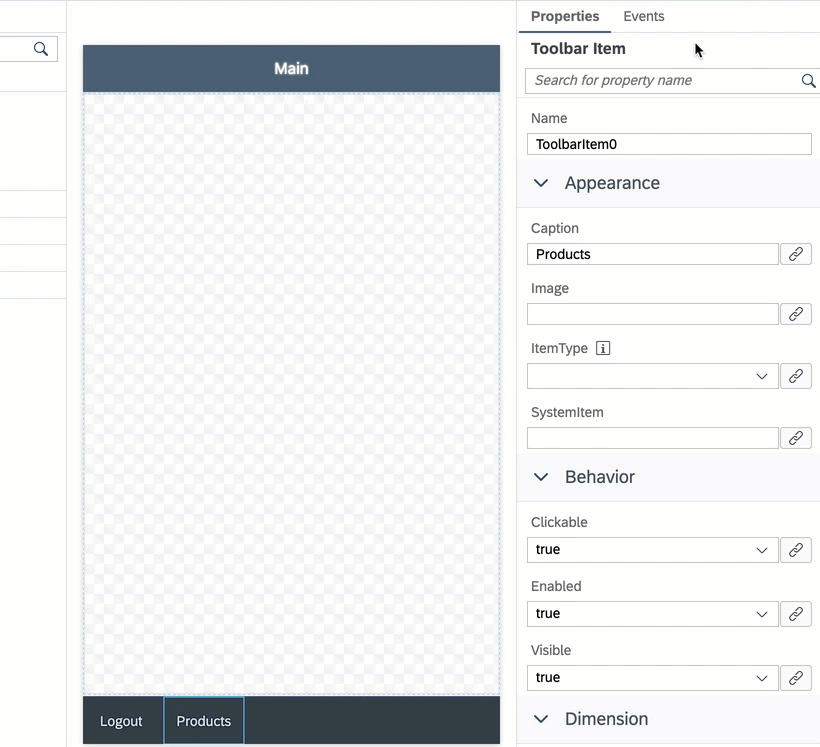

    Pages, actions and rules created are a starting point. You can edit those pages and make it your own.  At this point the MDK editor is no longer reading the annotations from OData.

    For the List page, MDK supports the List Report. To create a Detail page, MDK requires `UI.LineItem` and `UI.HeaderInfo` in the annotation file.

    >If the OData designer updates the backend services data schema (annotations), the MDK pages will stay as originally created. It will not automatically update the pages or overwrite your changes. You are *disconnected* from the annotations at this point.

[VALIDATE_1]
[ACCORDION-END]

[ACCORDION-BEGIN [Step 5: ](Deploy and activate the application)]

So far, you have learned how to build an MDK application in the SAP Business Application Studio editor. Now, we deploy this application definition to Mobile Services.

1. Right-click `Application.app` and select **MDK: Deploy**.

    !

2. Select deploy target as **Mobile Services**.

    !

    You should see **Deploy succeeded** message.

    !

[DONE]
[ACCORDION-END]

[ACCORDION-BEGIN [Step 6: ](Populate the QR code for app onboarding)]

SAP Business Application Studio has a feature to generate QR code for app onboarding.

Double-click the `Application.app` to open it in MDK Application Editor and click **Application QR Code** icon to populate the QR code.

!

!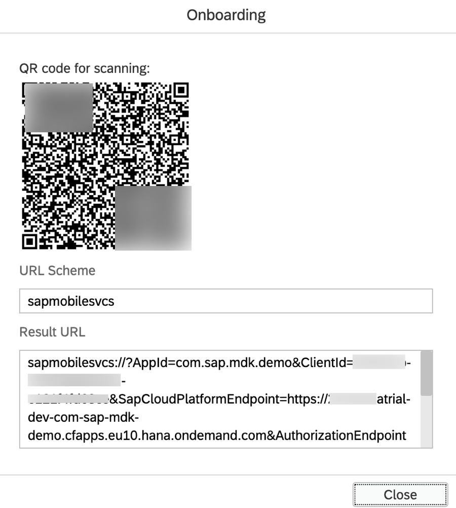

[DONE]
[ACCORDION-END]

[ACCORDION-BEGIN [Step 7: ](Run the app in MDK client)]

>Make sure you are choosing the right device platform tab above. Once you have scanned and onboarded using the onboarding URL, it will be remembered. When you Log out and onboard again, you will be asked either to continue to use current application or to scan new QR code.

[OPTION BEGIN [Android]]

1. Follow [these steps](https://github.com/SAP-samples/cloud-mdk-tutorial-samples/blob/master/Onboarding-Android-client/Onboarding-Android-client.md) to on-board the MDK client.

    Once you accept app update, you will see the **Main** page with **LOGOUT** and **PRODUCTS** options at bottom of the page. Tap **PRODUCTS**, you will navigate to Product List page.

    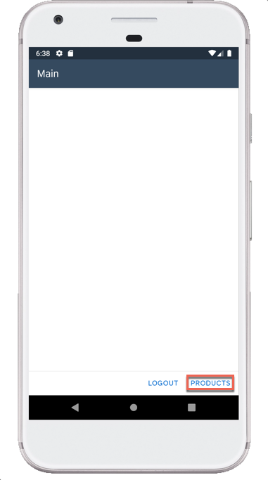

9. In following pages, you can create a new record, modify an existing record and even delete the record.

    
    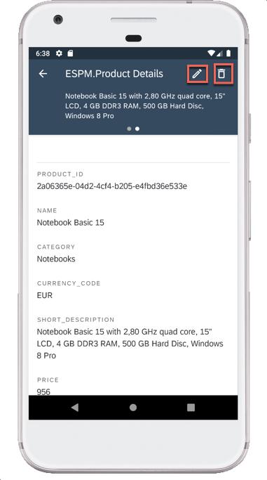

[OPTION END]

[OPTION BEGIN [iOS]]

1. Follow [these steps](https://github.com/SAP-samples/cloud-mdk-tutorial-samples/blob/master/Onboarding-iOS-client/Onboarding-iOS-client.md) to on-board the MDK client.

    Once you accept app update, you will see the **Main** page with **Logout** and **Products** options at bottom of the page. Tap **Products**, you will navigate to Product List page.

    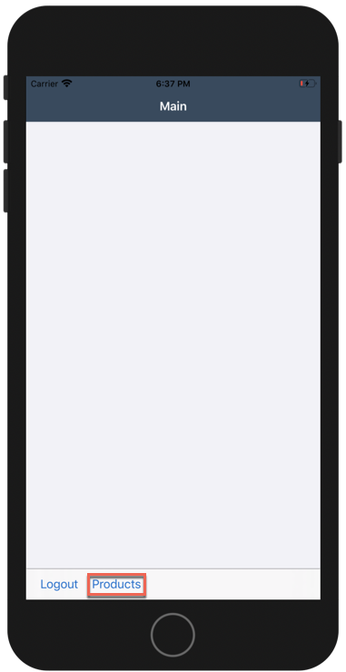

8. In following pages, you can create a new record, modify an existing record and even delete the record.

    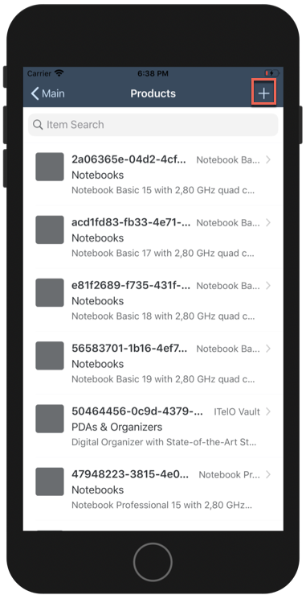
    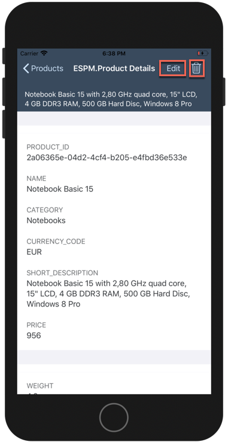

[OPTION END]

**Congratulations!** You have successfully created a fully functional CRUD native mobile application based on OData annotations and you are now all set to [Enable Push Notifications in the MDK Public Store Client](cp-mobile-dev-kit-push).

[DONE]
[ACCORDION-END]

---
