## Prerequisites
 - An ABAP system
    - See [Prerequisites](https://help.sap.com/doc/f53c64b93e5140918d676b927a3cd65b/Cloud/en-US/docs-en/guides/getting-started/mtb/prerequisites.html) for support matrix.
 - **Tutorial:** [How To access SAP Cloud Platform Mobile Services](fiori-ios-hcpms-setup).

## Details
### You will learn
  - How to enable Mobile Transaction Bridge
  - How to connect Mobile Transaction Bridge to a backend ABAP system
  - How to create a recording using Mobile Transaction Bridge

Using the Mobile Transaction Bridge feature within Mobile Services on Cloud Foundry, one can record classical ABAP transactions and generate an OData service on the fly, which can then be consumed via any frontend of your choice. In the case of SAP Business Application Studio or SAP Web IDE (if you are still using that), you have published templates that will help you generate mobile apps based on the mobile development kit client.

---

[ACCORDION-BEGIN [Step 1: ](Enable Mobile Transaction Bridge)]

In order to begin working with Mobile Transaction Bridge, you need to initialize the feature in your Mobile Services Admin cockpit.

1. Log in to your account's admin cockpit.

2. In **Service Marketplace**, search for **Mobile Services**.

    !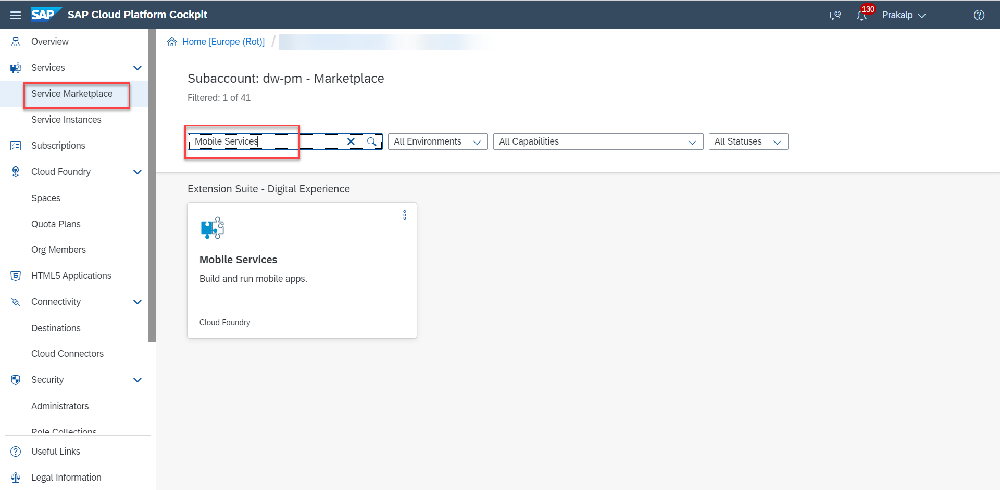

    Enter the Mobile Services Admin cockpit by clicking the support link.

    !

3. In the left navigation pane, choose **Settings > Mobile Transaction Bridge**.

    You should see an empty page with the **Initialize** button in the top right corner.

4. Click **Initialize**.

    !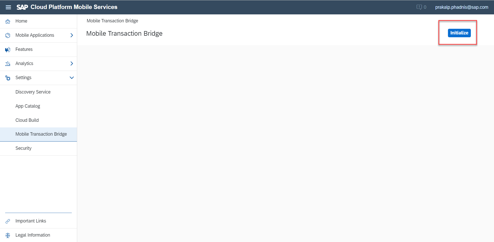

The initialization takes a minute or so, please wait. Once done you should see the blank page populated with various options.

[DONE]
[ACCORDION-END]

[ACCORDION-BEGIN [Step 2: ](Tour the Mobile Transaction Bridge cockpit)]
The default selection is **Recordings**. In this pane it is self-explanatory that one can either open the Recorder UI or copy its link for distribution.

!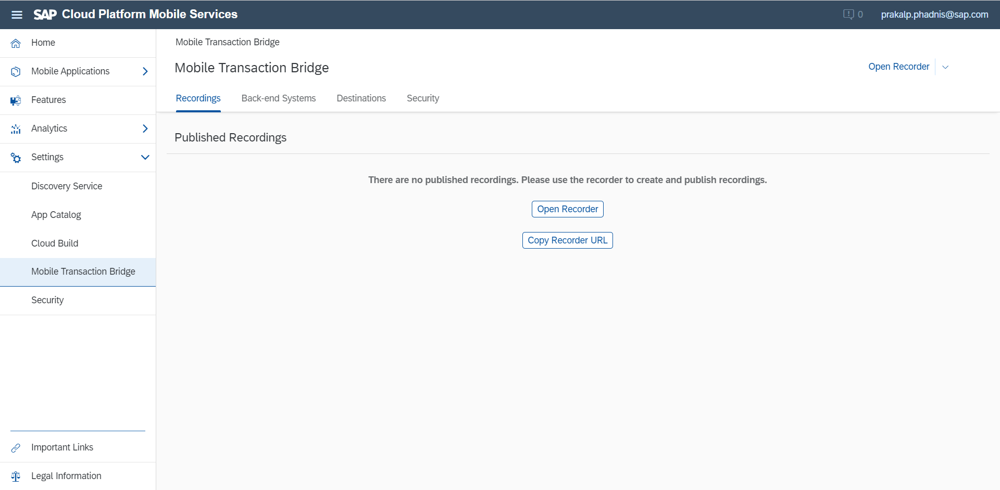

The **Back-end Systems** pane provides an overview of the configured ABAP backend systems and allows you to add new systems by clicking the plus icon ( **+** ). These systems are used during design time.

!

The **Destinations** pane provides an overview of the destinations to backend systems (generally via the SAP Cloud Connector) that are used to retrieve data. You can, of course, create new destinations here as well, by clicking the **Create** icon.

!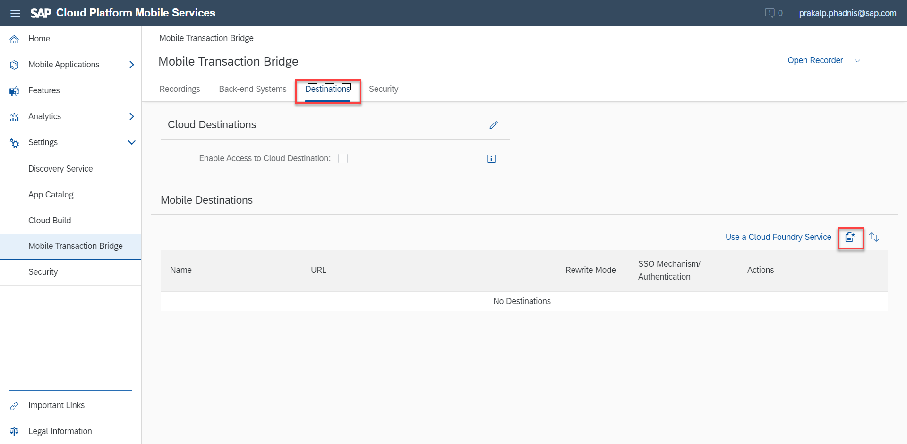

The **Security** pane displays information about the OAuth client and API endpoints. Generally, it is not necessary to make any changes in this pane.

!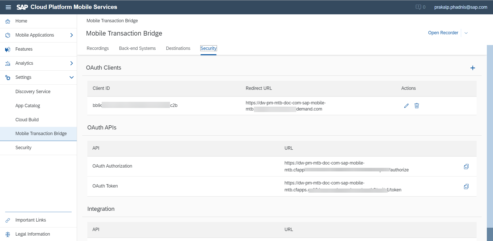

Now that you have initialized the MTB feature and looked at some of its configuration options, begin with maintaining the necessary configuration in order to be able to start creating our first recording.

[VALIDATE_1]
[ACCORDION-END]

[ACCORDION-BEGIN [Step 3: ](Maintain back-end ABAP system)]

1. Go to the MTB landing page and click **Back-end Systems**.

    Since this is the first time you are looking at MTB in this space, there are no systems maintained.

    In order to do so, click the **+** icon.

    !

2. In the resulting modal window, give the target system a descriptive name -- here we used the SID of the ABAP system.

3. In the URL field, enter the WebGUI URL for your ABAP system.

    !

Once you save the pane, should show you the system you have just created.

!

[DONE]
[ACCORDION-END]

[ACCORDION-BEGIN [Step 4: ](Open Mobile Transaction Bridge Recorder)]

Now that you have a back-end ABAP system to target, open the Recorder.

1. Click **Open Recorder** in the top-right corner of the page.

    !

    A browser (tab) opens and you are asked to log in.

2. Enter your credentials for your cloud account.

    !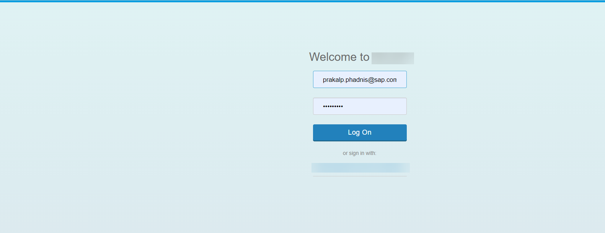

    > When accessing the recorder for the first time, you will see the following authorization error.

    >!

    >To fix this, you need to assign the MTB application and users the relevant role.

3. Navigate back to the subaccount level.

    !

4. In the left navigation pane, click **Security > Role Collections**.

      !

5. In the **Role Collections** pane, click the plus icon ( **+** ) in the top-right corner.

    !   

    Enter `MTB_TUT` for the name, and click **Create**.

    !

6. Now that the role collection has been created, you'll need to add roles and users to it.

    !

    Click the role collection to open the **Overview** page.

    Click **Edit** in the top-right corner.

    >**Please be patient**, it may take a few seconds before the UI will allow you to enter or search for roles.

    !

7. Add a role by choosing the dropdown beside **Role Name** and finding `**TransactionBridgeAdministrator**`.

8. Under **Application Identifier** find `**com-sap-mobile-mtb-<your-space-and-some-numbers>**`.

      !

    >You are using the Administrator Role here as an example. You will, of course, choose between the usage types that are appropriate.

9. Save the role collection by clicking **Save**.

    !

10. Go back to the recorder and log off.

    !

    Now, Logging back in should bring you into the recorder.

    !

Take special note of the message in the left pane of the browser window and the little red icon indicating a disconnected message in the middle of the right pane header.

These occur because the WebGUIConnector has not been enabled yet. This connector provides the hooks into the SAPGUI for HTML (that is, WebGUI) that you see in the right pane and is a key component in enabling you to record the transactions you want to use.

[DONE]
[ACCORDION-END]

[ACCORDION-BEGIN [Step 5: ](Enable the WebGUIConnector)]

>**IMPORTANT:** The SAP GUI and the SAP GUI for HTML (WebGUI) both allow for theming. Therefore, the WebGUI screenshots may look different from what you see. Please try to either change the theme or identify the settings based on your theme.

The WebGUIConnector setting is accessed via the menu found under the **More** navigation link in the main pane.

!

Enable the following 2 fields:

- **OK field**.

    !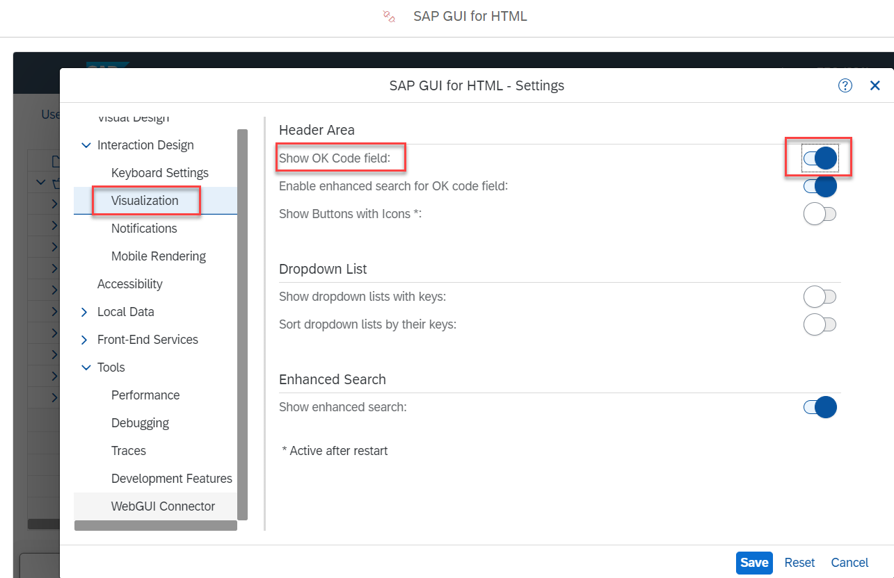

- The **WebGUIConnector**.

    !

Once you click **Save**, make sure to refresh your browser window.

> The `WebGUIConnector` is made available via the explicit allocation of the `S_WEBGUI` authorization in the backend system. See the **Configuring the ABAP Backend** prerequisites for more details.

Having refreshed the browser window, you should now see the following:

!

Pressing the OK button will allow the WebGUIConnector to connect and will in turn remove the error message in the left pane and turn the icon green.

!

Great! Now you are ready to start creating a recording.

[DONE]
[ACCORDION-END]

[ACCORDION-BEGIN [Step 6: ](Start the recording)]

Now that you have all the bits and pieces in place, go start to create your recording.

For the purposes of universality, you will use the ABAP transaction **`SU01`**.

1. Enter `SU01` in the **OK** field of your WebGUI in the main pane and press **Enter**.

    !

    Since this is a fresh space, there are no apps currently built in the left pane.

2. Press the plus icon ( **+** ) in the recorder pane.

    !

    Enter `MTB_TUT` for the name for your app.

    Click **Create**.

    !

3. In the next screen, the app appears in the Recorder pane on the left and the transaction is open in the pane on the right.

    !

    You are now ready to add sequences and steps to your recording. Begin with a simple sequence to find a user.

    Click the app in the left pane,.

4. Click the plus icon ( **+** ).

    !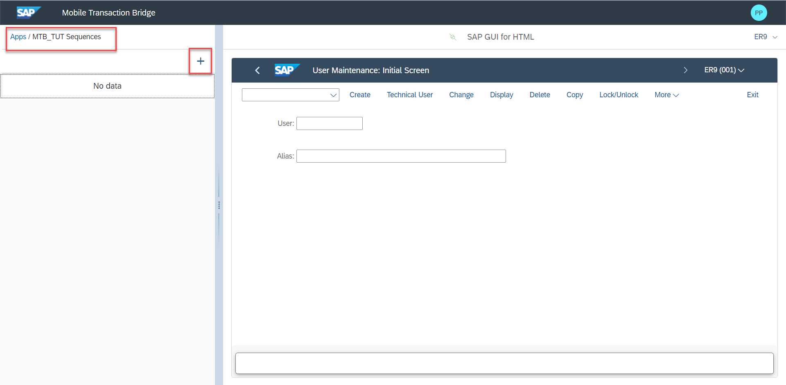

    In the popup, enter **`Find User`**, and click **Create**.

    !

5. Click the newly created sequence to open the pane for starting the recording.

    Click the **red** record button to start the recording.

    !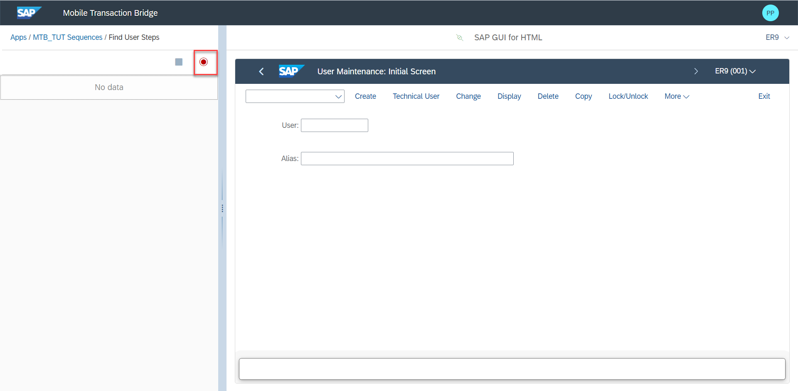

    Once pressed, a red border appears around the WebGUI and indicates that all the following steps, clicks, actions and so on will be recorded as steps. These will immediately be visible in the recorder pane.

    !

Now you are ready to do the recording.

[DONE]
[ACCORDION-END]

[ACCORDION-BEGIN [Step 7: ](Record an ABAP transaction)]

1. Place the cursor in the **User** field. When the magnifying glass icon appears, click it.

    !

    In the following modal window, choose the input fields.

    !

    In this case, let us use,

    - First name

    - Last name

    - Building

2. Choose the fields to add by:

    - Clicking **Configure** in the top-left corner of the main pane.

    - Then clicking the plus icon ( **+** ) beside each of the displayed fields.

    - After which you will **Add** the result in the Recorder pane.

    Uncheck the **Mandatory** checkbox in the recorder.

    !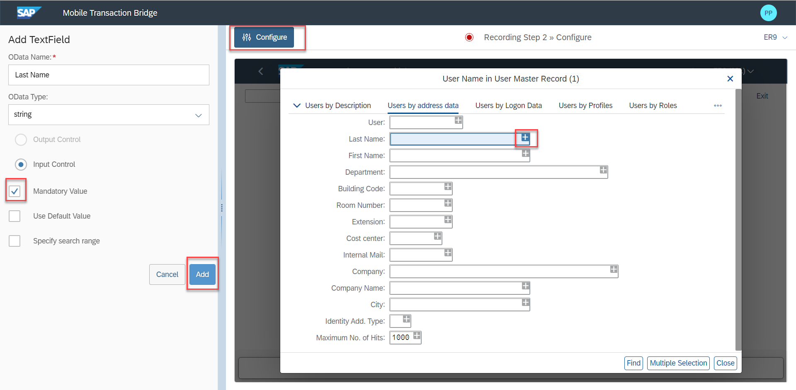

    >When a field has been successfully added, a **green tick mark** replaces the plus icon ( **+** ).

      !

3. Choose the subsequent result by:

    - First leave the selection mode by clicking **Configure**.

    - Click **Find** in the main pane.

      !

      This will bring up a table of results.

      Here, pressing the **Configure** button, provides the option of adding the result set as an output.

    - Choose the entire table by clicking the plus icon ( **+** ) at the top right corner of the results table.

    - And in the Recorder mark the checkbox next to the **Label**. This will choose the entire result set.

    !

4. Once you see the green tick marks, you are ready to exit the recorder for this step by:

    - Clicking **Configure** to exit selection mode.

    - Pressing the Stop button in the Recorder.

    - And finally, as an option, pressing the red 'X' at the bottom right, in the window in our main pane.

    !

[DONE]
[ACCORDION-END]

[ACCORDION-BEGIN [Step 8: ](Publish the recording)]

You are now ready to publish the recording to the Mobile Services account.

1. Using the breadcrumbs in the Recorder, navigate back to the list of apps.

    !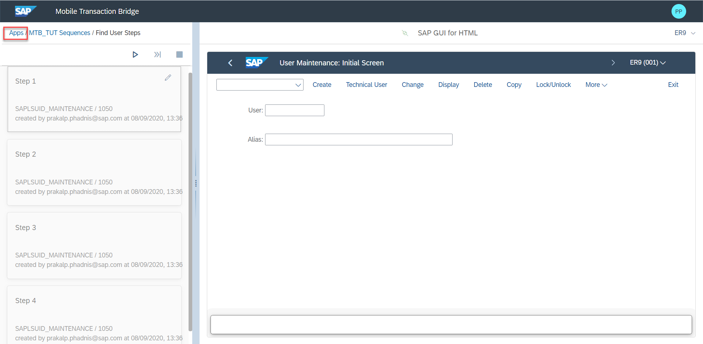

2. When you can see the app, find and click the magic wand icon.

    !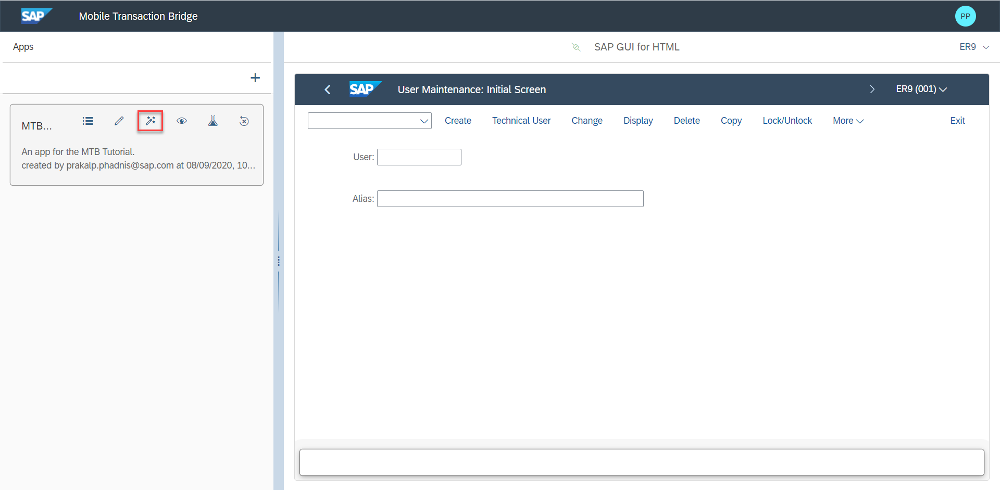

    In the popup, click **OK**.

    !

    In the confirmation box -- indicating the app was published -- click **OK**.

    !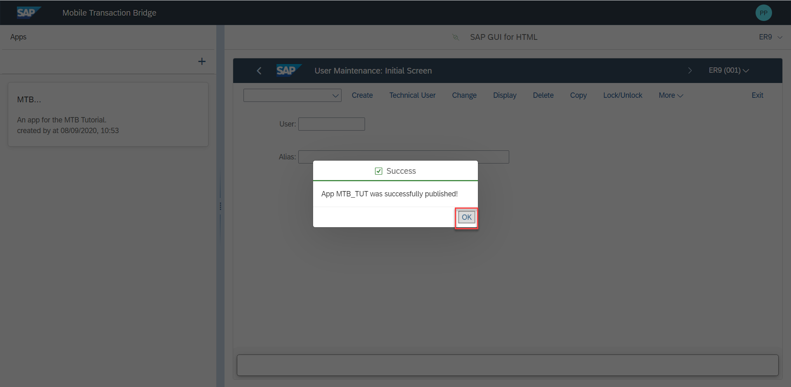

Navigate to the Mobile Services cockpit from where you started the recorder. Here, in the Mobile Transaction Bridge pane, under **Recordings** you should see the published app/recording.

!

Congratulations!! You have now created and published your first recording using the Mobile Transaction Bridge.

[DONE]
[ACCORDION-END]

---
