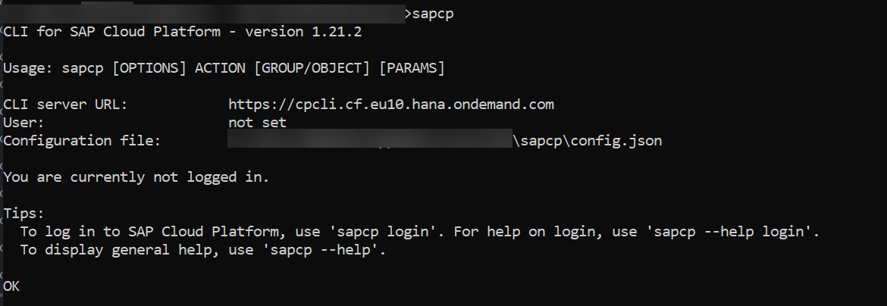
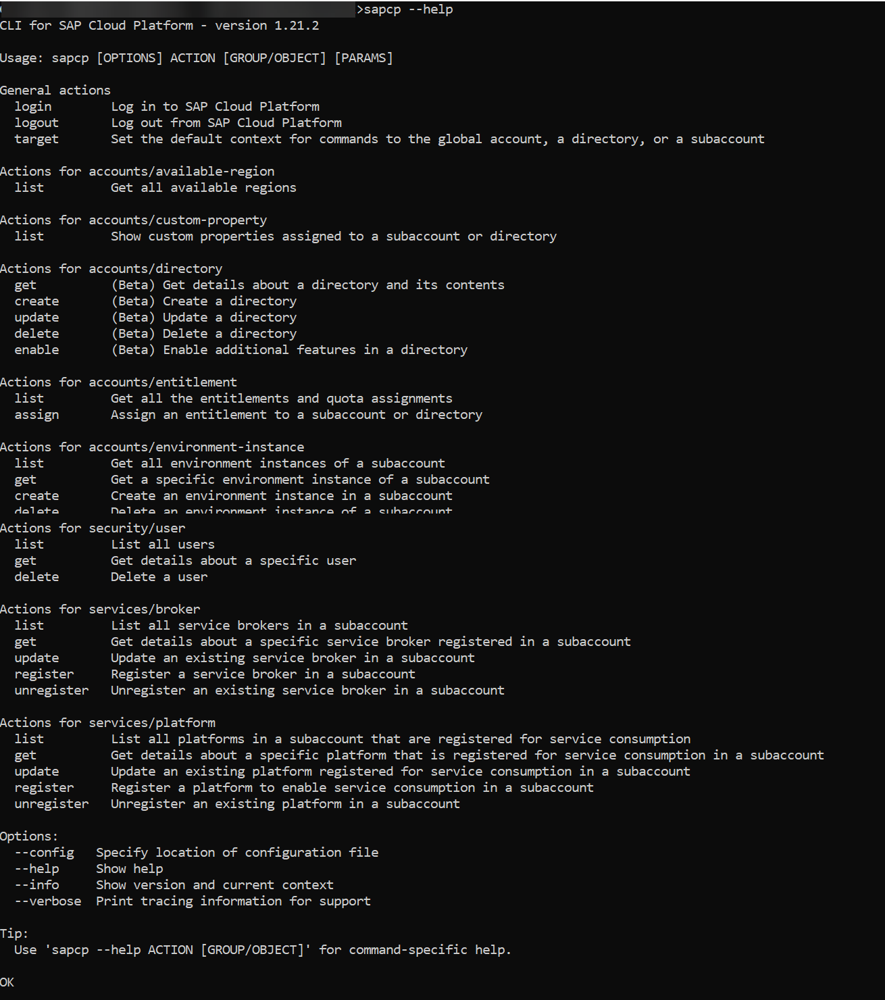
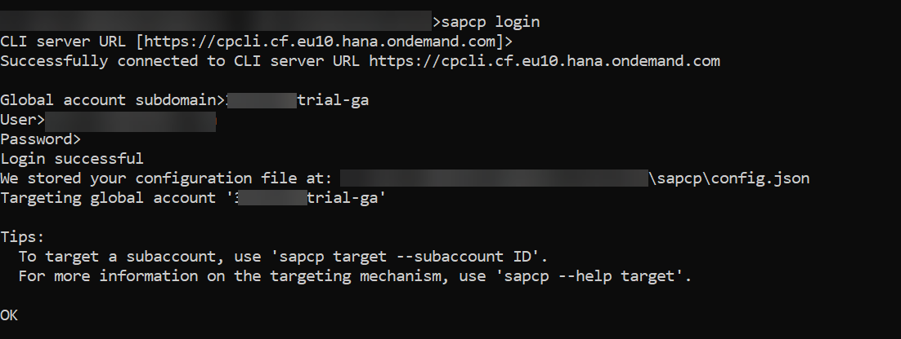

## Prerequisites
 - You have access to a trial account on SAP Cloud Platform that was initially created after April 2, 2020 (which means your trial account is on [feature set B](https://help.sap.com/viewer/3504ec5ef16548778610c7e89cc0eac3/Cloud/en-US/caf4e4e23aef4666ad8f125af393dfb2.html)).
 - You are familiar with [the basic concepts of SAP Cloud Platform Trial] (https://developers.sap.com/tutorials/cp-trial-quick-onboarding.html)

## Details
### You will learn
  - What the command-line interface for SAP Cloud Platform (sapcp CLI) is
  - For which global accounts you can use the sapcp CLI
  - How the sapcp CLI works
  - Where and how to download and install the client
  - How commands are structured
  - How to get help in the sapcp CLI
  - Where to find documentation


---

[ACCORDION-BEGIN [Step 1: ](What is the sapcp CLI?)]

The sapcp CLI is **an alternative to the cockpit**, for users who prefer working on the command line. It consists of a client and a server. The client needs to be installed on your computer (make sure you update it regularly!) and it interacts with SAP Cloud Platform through a server. You connect to this CLI server at login.

The base call to enter on the command line is `sapcp`.

Here are some of the tasks you can use the CLI for:

- Creating subaccounts
- Managing entitlements of global accounts and subaccounts
- Managing users and their authorizations in global accounts and subaccounts
- Subscribing to applications

[DONE]
[ACCORDION-END]


[ACCORDION-BEGIN [Step 1: ](For which global accounts can I use the sapcp CLI?)]

SAP is currently migrating all SAP Cloud Platform global accounts from the existing cloud management tools feature set A to the renovated cloud management tools feature set B. One of the innovations of feature set B is the new Command Line Interface (sapcp CLI) for account management. With your CF trial account, you can already try out the sapcp CLI.  

Here you can read more about the [Cloud Management Tools Feature Set B Innovations](https://help.sap.com/viewer/3504ec5ef16548778610c7e89cc0eac3/Cloud/en-US/caf4e4e23aef4666ad8f125af393dfb2.html).


[DONE]
[ACCORDION-END]

[ACCORDION-BEGIN [Step 2: ](sapcp CLI and cf CLI - What's the difference?)]

You may have worked with the [Cloud Foundry CLI (cf CLI)] (https://developers.sap.com/tutorials/cp-cf-download-cli.html) to manage your Cloud Foundry environment. Let's quickly explain how the **cf CLI** relates to the **sapcp CLI**:
The sapcp CLI is the CLI for working with SAP Cloud Platform accounts. You use the sapcp CLI for all tasks on global account, directory, and subaccount level. Going down the account hierarchy, the last step with sapcp CLI is creating a Cloud Foundry environment instance, which essentially creates a Cloud Foundry org. From org level onwards, i.e. for managing members in orgs and spaces, creating spaces, assigning quota to orgs and spaces, you use the cf CLI.

[VALIDATE_1]
[ACCORDION-END]


[ACCORDION-BEGIN [Step 3: ](Download and install the CLI client)]

Go to the [SAP Development Tools] (https://tools.hana.ondemand.com/#cloud-cpcli) download page to download the latest version of the CLI client for your operating system. Unpack the archive and copy the client file (for example, `sapcp.exe`) to your local system.

Open the directory with the client file in the command line and and enter `sapcp`.



You get version information, the usage, and you learn where the configuration file is located. Also, you get useful tips how to login and get help in the client.

[DONE]
[ACCORDION-END]

[ACCORDION-BEGIN [Step 4: ](Display the help overview)]

Now type in the following to show a list of all available commands and options:

```Bash
sapcp --help
```


[DONE]
[ACCORDION-END]


[ACCORDION-BEGIN [Step 5: ](Understand the command syntax: usage)]


Each command starts off with the base call `sapcp`. The syntax of the command itself is very close to natural language: It starts with a verb, i.e. the *action*, followed by a *group/object* combination. So you build a command by combining `sapcp` with an action (let's say *list*) and a group/object combination (let's say *accounts/subaccount*):  `sapcp list accounts/subaccount`

>For the time being, the object is always a singular noun. Even for list commands, where you might naturally want to use a plural form.

[DONE]
[ACCORDION-END]

[ACCORDION-BEGIN [Step 5: ](Understand the command syntax: options)]

Additionally, **options** and **parameters** can be added to a command. As you've seen in the overview of all commands, there are the following options that you can add at the beginning of each command. For example, to get help on a specific command or to use the verbose mode.

```Bash
sapcp --help list accounts/subaccount
```

```Bash
sapcp --verbose list accounts/subaccount
```


>The `--help` option can also be placed at the end of a command, for example `sapcp list accounts/subaccount --help`.

[VALIDATE_3]
[ACCORDION-END]


[ACCORDION-BEGIN [Step 5: ](Understand the command syntax: parameters)]

Parameters are added to the end, after the group/object combination. A command can have one so-called positional parameter as first one, and more optional or mandatory parameters may follow. The positional parameter is used without a key, all others have a key. The command help specifies the optionality of all parameters and describes what to input.

For example:

```Bash
sapcp assign security/role-collection "Global Account Administrator" --to-user example@mail.com --of-idp my-idp
```

"Global Account Administrator" is the positional parameter, and the other two parameters have keys (`--to-user` and `--of-idp`).

[DONE]
[ACCORDION-END]

[ACCORDION-BEGIN [Step 6: ](Login to your global account)]

Now let's log in. Login is always on global account level. Make sure you know the subdomain of your global account, which you find in the cockpit:

!

Enter the following command:

```Bash
sapcp login
```

The client proposes the CLI server URL for your trial and you can confirm with ENTER. Once you're logged in, it should look like this:



[DONE]
[ACCORDION-END]

[ACCORDION-BEGIN [Step 7:](Get started and find documentation)]

Here are a few simple examples of commands on global account level that you can try out:

|  Task                                   | Command call
|  :-------------                         | :-------------
|  List subaccounts                       | `sapcp list accounts/subaccount`
|  Get details of the global accounts     | `sapcp get accounts/global-account`
|  List role collections                  | `sapcp list security/role-collection`


Or go through the documentation to learn more:

- [Account Administration Using the CLI for SAP Cloud Platform](https://help.sap.com/viewer/65de2977205c403bbc107264b8eccf4b/Cloud/en-US/7c6df2db6332419ea7a862191525377c.html)
- [Commands in the sapcp CLI] (https://help.sap.com/viewer/65de2977205c403bbc107264b8eccf4b/Cloud/en-US/a03a5550cdd44fa48ff78d70ca7c9651.html)


[DONE]
[ACCORDION-END]


---
