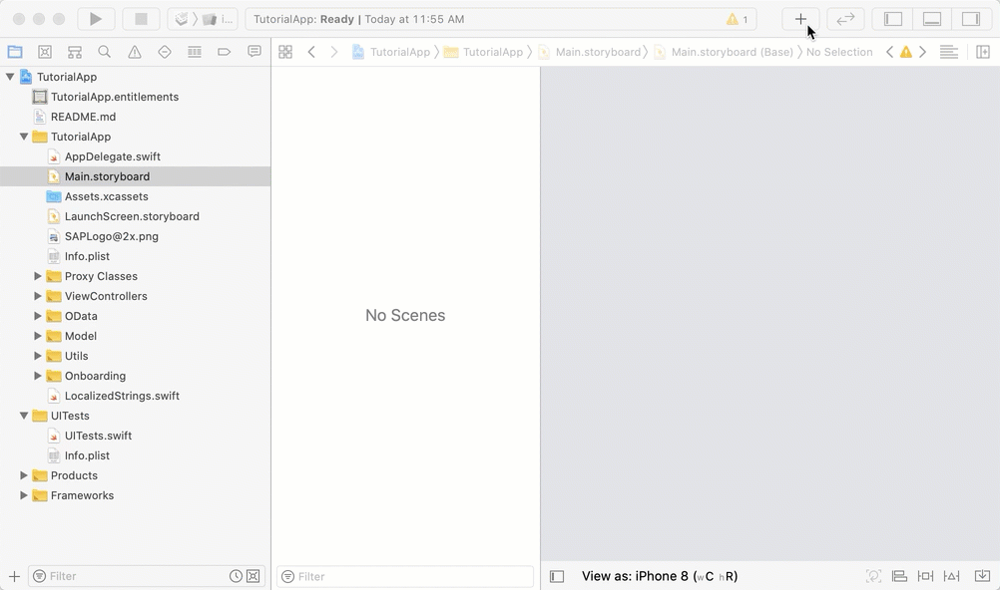
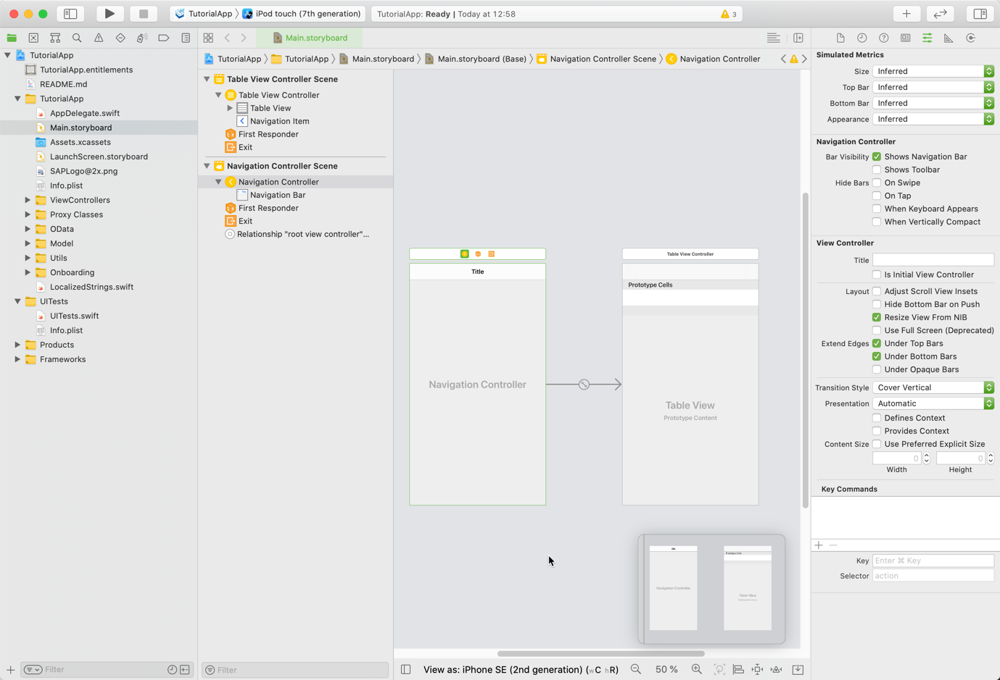
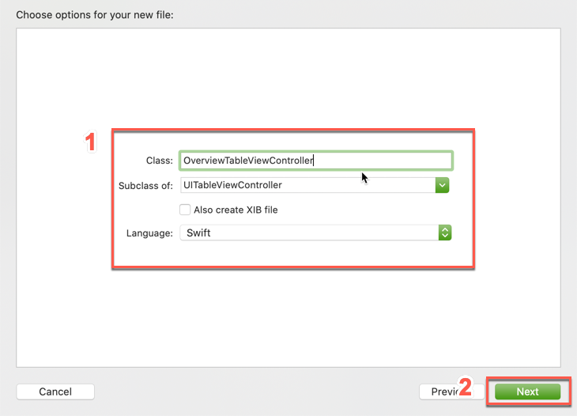
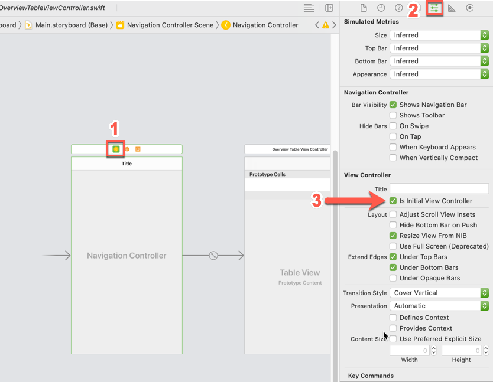
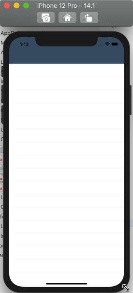
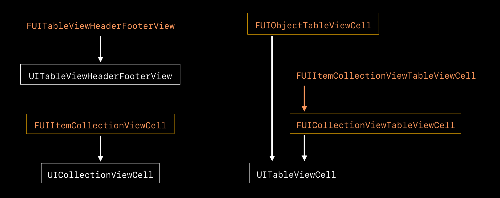
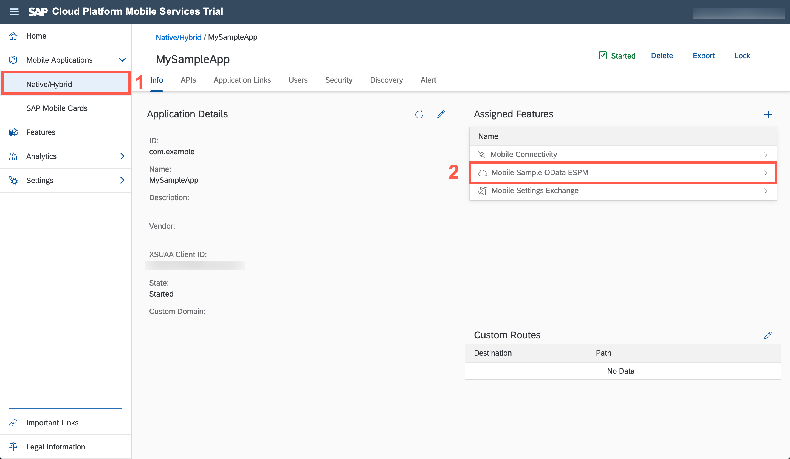
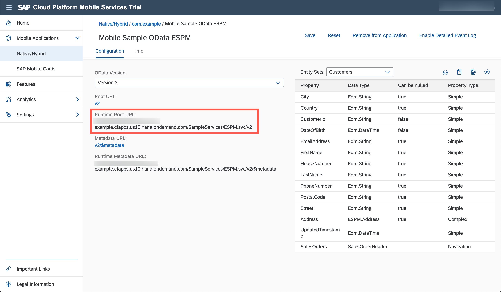
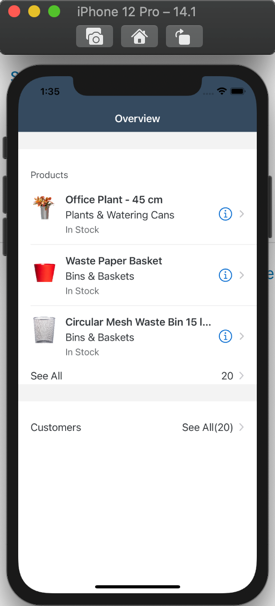

## Prerequisites
- **Development environment:** Apple Mac running macOS Catalina or higher with Xcode 11 or higher
- **SAP Cloud Platform SDK for iOS:** Version 5.0 or higher

## Details
### You will learn  
  - How to create your first iOS screen
  - How to retrieve data and display it on the screen
  - How to follow the SAP Fiori for iOS guidelines.

---

[ACCORDION-BEGIN [Step 1: ](Replace generated UI with your own)]

The Human Interface Guidelines for SAP Fiori for iOS has certain screens defined that you can use as guidance on how you could structure a business app.

Usually a business application has some sort of overview screen giving the user a entry point to key information he or she might need to do their daily work. From there, the user can navigate into more detailed information or more concrete workflows.

> If you're interested in the HIG of SAP for SAP Fiori for iOS, visit: [SAP Fiori for iOS Design Guidelines](https://experience.sap.com/fiori-design-ios/)

For this tutorial, you will implement an overview screen displaying a KPI Table View Header, products and customers.


In the [Set Up the SAP Cloud Platform SDK for iOS](group.ios-sdk-setup), you've learned how to create an Xcode project using the SAP Cloud Platform SDK for iOS Assistant. The result of the generation process of the iOS Assistant can be a split view screen if chosen. In this tutorial you will change the generated UI to match the screen shown above, the overview screen of your app.

1. First, open you Xcode project if not opened already and select the **`Main.storyboard`**, this will open the `Main.storyboard` in the Interface Builder of Xcode.

    > The Interface Builder allows you to create complete app flows including the UI for each screen of those flows.

    !

    For now go ahead and select all displayed View Controllers in the `Main.storyboard` and simply delete them.

    !

2. Next, click the **Object Library** and search for **`Table View Controller`**. Drag and drop the object on the canvas of the Interface Builder.

    !

3. Thinking ahead, you know that you want to have navigation to various screens from the overview screen. Using a Navigation Controller and embedding the just-created View Controller in it allows us to use the power of the Navigation Controller for navigation. The Navigation Controller handles the navigation stack for you, which is exactly what you want.

    Select the added View Controller and click **Editor > Embed In > Navigation Controller**. This will embed your View Controller in a Navigation Controller. You should see the Navigation Bar appear in the View Controller.

    !

    !

4. Almost every View Controller you're adding to the storyboard needs a **Cocoa Touch Class** representing the logic implementation of that View Controller.

    Control + click your project source in the **Project Navigator** on the left-hand side and select **New File**.

    !

5. Select the **Cocoa Touch Class** in the upcoming modal sheet, and click **Next**.

    !

    Make sure that your class is going to subclass of **`UITableViewController`** and change the name to **`OverviewTableViewController`**. Click **Next** and then **Create**.

    !

    Great! You've created your first Table View Controller Swift class, now you have to set this class as **Custom Class** in the **`Main.storyboard`** View Controller.

6. Open the storyboard and select the created View Controller. On the right side, you can see the side bar. Click the **Identity Inspector** to set the custom class to **`OverviewTableViewController`** and hit return on your keyboard.

    !

    Notice the title of the Table View Controller on the left side changes accordingly to the entered custom class.

7. Lastly you have to make the Navigation Controller an initial View Controller. Doing this will allow us to instantiate an initial View Controller from Storyboard and tells the system the main entry point for that specific Storyboard.

    Select the **Navigation Controller** and open the **Attributes Inspector** to check the box next to **Is Initial View Controller**.

    !

[DONE]
[ACCORDION-END]

[ACCORDION-BEGIN [Step 2: ](Change the Application UI Manager code to display the overview)]

In order to display the newly added overview screen right after the onboarding process is finished, you have to make some manual changes in the **`ApplicationUIManager.swift`** class. This class is mainly responsible for coordinating the UI flow for user onboarding all the way to the first screen after the onboarding process.

1. Open the `ApplicationUIManager.swift` class using the Project Navigator and look for the `showApplicationScreen(completionHandler:)` method.

    > **Hint:** You can use the `Open Quickly` feature of Xcode to search for the `ApplicationUIManager` class with `Command + Shift + O`. Once you've opened the file, you can quickly jump to the `showApplicationScreen(completionHandler:)` function by using the **jump bar** at the top of the editor area pane.

    !

    In the method you see an `if-else` statement initializing a Split View Controller, which is non-existing anymore because you have your Overview Table View Controller.

    > For all upcoming tutorials and code snippets, you will find inline comments used to help you understand what the code is actually doing. Read the inline comments carefully!

2. Change the method code to the following:

    ```Swift[15-16]
    func showApplicationScreen(completionHandler: @escaping (Error?) -> Void) {
        // Check if an application screen has already been presented
        guard self.isSplashPresented else {
            completionHandler(nil)
            return
        }

        // Restore the saved application screen or create a new one
        let appViewController: UIViewController
        if let savedViewController = self._savedApplicationRootViewController {
            appViewController = savedViewController
        } else {
            // This will retrieve an instance of the Main storyboard and instantiate the initial view controller which is the Navigation Controller. Force cast to UINavigationController and assign the instance as appViewController.

            let overviewTVC = UIStoryboard(name: "Main", bundle: Bundle.main).instantiateInitialViewController() as! UINavigationController
            appViewController = overviewTVC
        }
        self.window.rootViewController = appViewController
        self._onboardingSplashViewController = nil
        self._savedApplicationRootViewController = nil
        self._coveringViewController = nil

        completionHandler(nil)
    }

    ```

Great you did all necessary steps to replace the generated UI with your own. Go ahead and run the app on **`iPhone 12 Pro`** or any other simulator to see the result.

> In case you haven't onboarded yet, go through the onboarding process before seeing your Overview Screen appear.



[DONE]
[ACCORDION-END]


[ACCORDION-BEGIN [Step 3: ](Implement basic functionality of overview screen)]

As you can see, the overview screen is a little bit more complicated then just simply displaying a Table View with some data. The overview screen contains the following UI controls:

- `UITableView`: A table dequeuing and displaying registered Table View Cells.
- `FUIObjectTableViewCell`: A SAP Fiori control used to display business entity objects. [`FUIObjectTableViewCell`](https://help.sap.com/doc/978e4f6c968c4cc5a30f9d324aa4b1d7/Latest/en-US/Documents/Frameworks/SAPFiori/Classes/FUIObjectTableViewCell.html)
- `FUICollectionViewTableViewCell`: A SAP Fiori control allowing you to display a `UICollectionView` in a Table View Cell. The cell handles the resizing for you. [`FUICollectionViewTableViewCell`](https://help.sap.com/doc/978e4f6c968c4cc5a30f9d324aa4b1d7/Latest/en-US/Documents/Frameworks/SAPFiori/Classes/FUICollectionViewTableViewCell.html)
- `UITableViewCell`: The mother of all cells!
- `FUITableViewHeaderFooterView`: A SAP Fiori control used to display Header Footer Views for a Table View section. [`FUITableViewHeaderFooterView`](https://help.sap.com/doc/978e4f6c968c4cc5a30f9d324aa4b1d7/Latest/en-US/Documents/Frameworks/SAPFiori/Classes/FUITableViewHeaderFooterView.html)
- `FUIKPIHeader`: A SAP Fiori control used for displaying `KPIs` as a Table View Header. [`FUIKPIHeader`](https://help.sap.com/doc/978e4f6c968c4cc5a30f9d324aa4b1d7/Latest/en-US/Documents/Frameworks/SAPFiori/Classes/FUIKPIHeader.html)
- `FUILoadingIndicatorView`: A SAP Fiori control used to display a loading indicator on screen. [`FUILoadingIndicatorView`](https://help.sap.com/doc/978e4f6c968c4cc5a30f9d324aa4b1d7/Latest/en-US/Documents/Frameworks/SAPFiori/Classes/FUILoadingIndicatorView.html)
- `FUIItemCollectionViewCell`: A SAP Fiori control used to display business entity objects in a Collection View Cell. [`FUIItemCollectionViewCell`](https://help.sap.com/doc/978e4f6c968c4cc5a30f9d324aa4b1d7/Latest/en-US/Documents/Frameworks/SAPFiori/Classes/FUIItemCollectionViewCell.html)

If you look at the list of controls you might recognize that you're picking from not only SAP Fiori controls but also from Apple `UIKit` controls. Because all of the SAP Fiori controls are written natively in Swift and inherit of `UIKit` controls, you can pick and choose the controls you need.

!

You will now implement some code to set up the `OverviewTableViewController` for displaying all the above mentioned controls, load data from the backend using the `SAPOData` framework, and perform navigation to the customer and product list.

1. Open the `OverviewTableViewController.swift` file and add the following import statements right below the `import UIKit` statement:

    ```Swift
    import SAPFiori
    import SAPFoundation
    import SAPOData
    import SAPFioriFlows
    import SAPCommon

    ```

    You are going to use APIs and classes from all of those SAP iOS SDK frameworks to build the Overview screen.

    The overview screen will have a short list of products and a collection of customers. Implementing two arrays containing elements of type **Product** and **Customer** will do the job of storing the loaded entities later on.

2. Instantiate two arrays as class properties:

    ```Swift

    private var products = [Product]()
    private var customers = [Customer]()

    ```

3. Because you want to use the logging API of the `SAPCommon` framework you have to retrieve and store an instance of the logger. Luckily the logger gets initialized in the `AppDelegate` through generated code by the iOS Assistant. The logger is initialized with a default log level of **`Debug`**.

    Add the following line of code above the products array:

    ```Swift

    private let logger = Logger.shared(named: "OverviewTableViewController")

    ```

4. Next, implement all the needed Table View data source and delegate methods you need. Fortunately you used a Table View Controller instead of a View Controller, and because you did that you can simply override those methods directly in class without declaring the needed protocols (`UITableViewDataSource, UITableViewDelegate`) in the class definition.

    Implement the needed methods below the `viewDidLoad()` method, so that your class looks like that:

    ```Swift[32-81]
    //
    //  OverviewTableViewController.swift
    //  TutorialApp
    //
    //  Created by Muessig, Kevin on 3/20/20.
    //  Copyright © 2020 SAP. All rights reserved.
    //

    import UIKit
    import SAPFiori
    import SAPFoundation
    import SAPOData
    import SAPFioriFlows
    import SAPCommon

    class OverviewTableViewController: UITableViewController {

      private var products = [Product]()
      private var customers = [Customer]()

      override func viewDidLoad() {
          super.viewDidLoad()

      }

      // MARK: - Table view data source

      /**
        If you look at the image displaying the Overview Screen when done you can see that there are 2 sections.
        One is for the customer and one for the product. If you look closely you can see the gray dividers between those sections. These are actually of type FUITableViewHeaderFooterView which makes it necessary to have sections defined for them as well. That is why the number is 4.
      */
      override func numberOfSections(in tableView: UITableView) -> Int {
          return 4
      }

      /**
        Here you tell the Table View how many rows you want to display for each section.
        You can use the *Switch* statement to do so.

        - Case 1:   return 3 if the count of available products is equal or higher then 3
        - Case 3:   return 1 if the count of available customers is equal or higher then 1. That is because you only display the FUICollectionViewTableViewCell here.
        - Default:  return 0 because those are the dividers which are not going to display any rows.

      */
      override func tableView(_ tableView: UITableView, numberOfRowsInSection section: Int) -> Int {
          switch section {
          case 1: if products.count >= 3 { return 3 }
          case 3: if customers.count >= 1 { return 1 }
          default:
              return 0
          }
          return 0
      }

      /**
      At the moment return a UITableViewHeaderFooterView.
      */
      override func tableView(_ tableView: UITableView, viewForHeaderInSection section: Int) -> UIView? {
          return UITableViewHeaderFooterView()
      }

      /**
      At the moment return a UITableViewHeaderFooterView.
      */
      override func tableView(_ tableView: UITableView, viewForFooterInSection section: Int) -> UIView? {
          return UITableViewHeaderFooterView()
      }

      /**
      At the moment return a UITableViewCell.
      */
      override func tableView(_ tableView: UITableView, cellForRowAt indexPath: IndexPath) -> UITableViewCell {
          return UITableViewCell()
      }

      // MARK: - Navigation

      // In a storyboard-based application, you will often want to do a little preparation before navigation
      override func prepare(for segue: UIStoryboardSegue, sender: Any?) {
          // Prepare segue for navigation
      }
    }

    ```

[DONE]
[ACCORDION-END]


[ACCORDION-BEGIN [Step 4: ](Implement FUITableViewHeaderFooterView)]

To finish building the screen's layout you are going to implement the dividers and the Header/Footer for the products and customers.

1. First, register the `FUITableViewHeaderFooterView` in the `viewDidLoad()` method:

    ```Swift[4]
    override func viewDidLoad() {
        super.viewDidLoad()

        tableView.register(FUITableViewHeaderFooterView.self, forHeaderFooterViewReuseIdentifier: FUITableViewHeaderFooterView.reuseIdentifier)
    }

    ```

2. Next, replace the `tableView(_:viewForHeaderInSection)` method with the implementation code:

    ```Swift

    /**
    Dequeue the registered FUITableViewHeaderFooterView and force cast it to the respective class.
    Again use a Switch-statement to distinguish between the different sections.

    - Case 1:   You want to see just the title for the Product section header
    - Case 3:   You want to see title and an attribute for the Customer section header.
    - Default:  Return the divider view.

    */
    override func tableView(_ tableView: UITableView, viewForHeaderInSection section: Int) -> UIView? {
       let headerFooterView = tableView.dequeueReusableHeaderFooterView(withIdentifier: FUITableViewHeaderFooterView.reuseIdentifier) as! FUITableViewHeaderFooterView

       switch section {
       case 1:
           headerFooterView.style = .title
           headerFooterView.titleLabel.text = NSLocalizedString("Products", comment: "")
           return headerFooterView
       case 3:
           headerFooterView.style = .attribute
           headerFooterView.titleLabel.text = NSLocalizedString("Customers", comment: "")
           headerFooterView.attributeLabel.text = NSLocalizedString("See All(\(customers.count))", comment: "")
           headerFooterView.didSelectHandler = {
               // TODO: Implement later
           }
           return headerFooterView
       default:
           let divider = UIView()
           divider.backgroundColor = .preferredFioriColor(forStyle: .line)
           return divider
       }
    }

    ```

3. Replace the `tableView(_:viewForFooterInSection)` method with the following code:

    ```Swift

    /**
    For the Footer you display a FUITableViewHeaderFooterView set to style attribute like the customer section header.
    If it is not the product section then show an empty UIView.
    */
    override func tableView(_ tableView: UITableView, viewForFooterInSection section: Int) -> UIView? {
       if section == 1 {
           let headerFooterView = tableView.dequeueReusableHeaderFooterView(withIdentifier: FUITableViewHeaderFooterView.reuseIdentifier) as! FUITableViewHeaderFooterView
           headerFooterView.didSelectHandler = {
               // TODO: Implement later
           }
           headerFooterView.style = .attribute
           headerFooterView.titleLabel.text = NSLocalizedString("See All", comment: "")
           headerFooterView.attributeLabel.text = "\(products.count)"
           return headerFooterView
       } else {
           return UIView(frame: CGRect(x: 0, y: 0, width: 0, height: 0))
       }
    }

    ```


[DONE]
[ACCORDION-END]


[ACCORDION-BEGIN [Step 5: ](Load customer and product data)]

Before you continue implementing the Table View's data source and delegate methods, you go and implement the data loading methods.

Thanks to the generated data service and proxy classes, you don't have to implement much to load data from the sample OData service.

1. You need to retrieve an instance of the `ESPMContainer` to be able to have access to the generated data layer. The data service is globally accessible through the onboarding session. Depending on how you generated your Xcode project you might support Online or Offline OData. This has an effect on what OData controller you use to retrieve the data service.

**For Online OData**

Add the following import statement to your class:

```Swift
import SAPOData

```

Implement the following lines of code directly below the logger instance as class properties:

```Swift
/// First retrieve the destinations your app can talk to from the AppParameters.
let destinations = FileConfigurationProvider("AppParameters").provideConfiguration().configuration["Destinations"] as! NSDictionary

/// Create a computed property that uses the OnboardingSessionManager to retrieve the onboarding session and uses the destinations dictionary to pull the correct destination. Of course you only have one destination here. Handle the errors in case the OData controller is nil. You are using the AlertHelper to display an AlertDialogue to the user in case of an error. The AlertHelper is a utils class provided through the iOS Assistant.
var dataService: ESPMContainer<OnlineODataProvider>? {
    guard let odataController = OnboardingSessionManager.shared.onboardingSession?.odataControllers[destinations["com.sap.edm.sampleservice.v2"] as! String] as? Comsapedmsampleservicev2OnlineODataController, let dataService = odataController.espmContainer else {
        AlertHelper.displayAlert(with: NSLocalizedString("OData service is not reachable, please onboard again.", comment: ""), error: nil, viewController: self)
        return nil
    }
    return dataService
}

```

**For Offline OData**

Add the following import statement to your class:

```Swift
import SAPOfflineOData

```

Implement the following lines of code directly below the logger instance as class properties:

```Swift

/// First retrieve the destinations your app can talk to from the AppParameters.
let destinations = FileConfigurationProvider("AppParameters").provideConfiguration().configuration["Destinations"] as! NSDictionary

var dataService: ESPMContainer<OfflineODataProvider>? {
    guard let odataController = OnboardingSessionManager.shared.onboardingSession?.odataControllers[destinations["com.sap.edm.sampleservice.v2"] as! String] as? Comsapedmsampleservicev2OfflineODataController, let dataService = odataController.espmContainer else {
        AlertHelper.displayAlert(with: NSLocalizedString("OData service is not reachable, please onboard again.", comment: ""), error: nil, viewController: self)
        return nil
    }
    return dataService
}

```


2. To fetch available customers, implement the following method below the closing bracket of the `viewDidLoad()` method:

    ```Swift

    /**
    First you define a DataQuery to perform an expand for the customer's sales orders.
    This data query object you can simply pass into the fetchCustomers(:) method call. Handle the errors and display an Alert Dialogue to the user.

    Using a DispatchGroup allows us to sequentially run background tasks and perform a certain action as soon as all tasks are completed. First you enter the group and you have to leave the group in any place where you return out of the block.

    In case you retrieve data from the backend sort the customers by the amount of sales orders they have and set them to the array.
    */
    private func fetchCustomers(_ group: DispatchGroup) {
        group.enter()

        let query = DataQuery().expand(Customer.salesOrders)
        dataService?.fetchCustomers(matching: query) { [weak self] result, error in
            if let error = error {
                AlertHelper.displayAlert(with: NSLocalizedString("Failed to load list of customers!", comment: ""), error: error, viewController: self!)
                self?.logger.error("Failed to load list of customers!", error: error)
                group.leave()
                return
            }
            // sort the customer result set by the number of available sales orders by customer.
            self?.customers.append(contentsOf: result!.sorted(by: { $0.salesOrders.count > $1.salesOrders.count }))
            group.leave()
        }
    }

    ```

3. Next implement the method responsible for fetching all products. Add the following lines of code below the closing bracket of the `fetchCustomers(_:)` method:

    ```Swift
    /**
    Handle the errors and display an Alert Dialogue to the user.

    In case you retrieve data from the backend sort the customers by the amount of sales orders they have and set them to the array.
    */
    private func fetchProducts(_ group: DispatchGroup) {
        group.enter()

        dataService?.fetchProducts() { [weak self] result, error in
            if let error = error {
                AlertHelper.displayAlert(with: NSLocalizedString("Failed to load list of products!", comment: ""), error: error, viewController: self!)
                self?.logger.error("Failed to load list of products!", error: error)
                group.leave()
                return
            }
            self?.products.append(contentsOf: result!)

            group.leave()
        }
    }

    ```

4. Now let's bring both of those methods together by implementing a `loadData()` method right above the `fetchCustomers(_:)` method.

    ```Swift

    /**
    Show a loading indicator as soon as the method gets called.
    Create a DispatchGroup and call both fetch methods and pass in the created group.

    group.notify will be called as soon as both methods called group.leave(). If notify gets called execute the block which will hide the loading indicator, reload the data of the table view.
    */
    private func loadData() {
       showFioriLoadingIndicator()

       let group = DispatchGroup()

       fetchCustomers(group)

       fetchProducts(group)

       group.notify(queue: DispatchQueue.main) {
           self.hideFioriLoadingIndicator()
           self.tableView.reloadData()
       }
    }

    ```

    > The code won't compile yet as you haven't conformed to the **`SAPFioriLoadingIndicator`** protocol yet.

5. Let the `OverviewTableViewController` class conform to the **`SAPFioriLoadingIndicator`** protocol and implement the needed property:

    ```Swift
    class OverviewTableViewController: UITableViewController, SAPFioriLoadingIndicator {
        var loadingIndicator: FUILoadingIndicatorView?

        //...
    }

    ```

6. Call the `loadData()` method as last statement in the `viewDidLoad()`.

[DONE]
[ACCORDION-END]


[ACCORDION-BEGIN [Step 6: ](Implement cellForRowAt method)]

Now that you can fetch the needed data sets, you can go ahead and finish implementing the `tableView(_:cellForRowAt:)` method.

Before you do this you have to take care of the product image lazy loading. You're going to use a simple image cache in the form of a Dictionary; also you need a property which holds the product image URLs.

1. Add the following lines of code directly above the product array class property:

    ```Swift
    private var imageCache = [String: UIImage]()
    private var productImageURLs = [String]()

    ```

2. To get the product image URLs, you need to add the following line of code to the `fetchProducts(_:)` method directly above the `self?.products.append(contentsOf: result!)` line:

    ```Swift
    self?.productImageURLs = result!.map { $0.pictureUrl ?? "" }

    ```

3. Now you only have to implement the method responsible for loading the product images. Implement the following method directly below the closing bracket of the `fetchProducts(_:)` method:

    ```Swift
    /**
    Retrieve an instance of the AppDelegate to get access to the SAPURLSession.
    Safe unwrap the SAPURLSession with the help of a guard-statement.
    Start a data task to download the image using the passed in URL. If the download task is completed check for errors. and safe the loaded image in the image cache.
    Dispatch back to the main thread and pass the loaded image.
    */
    private func loadImageFrom(_ url: URL, completionHandler: @escaping (_ image: UIImage) -> Void) {
        let appDelegate = UIApplication.shared.delegate as! AppDelegate
        if let sapURLSession = appDelegate.sessionManager.onboardingSession?.sapURLSession {
            sapURLSession.dataTask(with: url, completionHandler: { data, _, error in

                if let error = error {
                    self.logger.error("Failed to load image!", error: error)
                    return
                }

                if let image = UIImage(data: data!) {
                    // safe image in image cache
                    self.imageCache[url.absoluteString] = image
                    DispatchQueue.main.async { completionHandler(image) }
                }
            }).resume()
        }
    }

    ```

4. Before you can start dequeuing the needed cells, complete the `viewDidLoad()` method:

    ```Swift[4-15]
    override func viewDidLoad() {
        super.viewDidLoad()

        // Set the navigation item's title to "Overview".
        navigationItem.title = NSLocalizedString("Overview", comment: "")

        tableView.register(FUIObjectTableViewCell.self, forCellReuseIdentifier: FUIObjectTableViewCell.reuseIdentifier)
        tableView.register(FUICollectionViewTableViewCell.self, forCellReuseIdentifier: FUICollectionViewTableViewCell.reuseIdentifier)
        tableView.register(FUITableViewHeaderFooterView.self, forHeaderFooterViewReuseIdentifier: FUITableViewHeaderFooterView.reuseIdentifier)

        // To make sure the FUICollectionViewTableViewCell gets displayed correctly you set the estimated row height to 180 and the row height to automatic dimension which will allow the table view to resize the cell.
        tableView.estimatedRowHeight = 180
        tableView.rowHeight = UITableView.automaticDimension

        loadData()
    }

    ```

5. Before you go ahead and implement the `tableView(_:viewDidLoad:)`, you need to retrieve the URL of your service. The data task you're going to use will use the URL to download the needed product images.

    Open your Mobile Services instance and select your app configuration in the `Native/Hybrid` screen. There you click  **Mobile Sample OData ESPM** in the **Assigned Features** section.

    !

6. The detail screen for the `Mobile Sample OData ESPM` will open. There you find the **`Runtime Root URL`** for this service, copy the whole URL as you will need it in a second.

    !

7. Let's bring some life into our screen:

    ```Swift[19]
    override func tableView(_ tableView: UITableView, cellForRowAt indexPath: IndexPath) -> UITableViewCell {

      switch indexPath.section {
      case 1:
              // Get the needed product using the IndexPath and deque the FUIObjectTableViewCell.
              let product = products[indexPath.row]
              let productCell = tableView.dequeueReusableCell(withIdentifier: FUIObjectTableViewCell.reuseIdentifier) as! FUIObjectTableViewCell

              // Set the data to the dequeued cell.
              productCell.headlineText = product.name ?? "-"
              productCell.subheadlineText = product.categoryName ?? "-"

              // Show In Stock or Out of Stock depending on the available quantity of the product.
              productCell.footnoteText = product.stockDetails?.quantity?.intValue() != 0 ? NSLocalizedString("In Stock" , comment: "") : NSLocalizedString("Out of Stock", comment: "")
              // set a placeholder image
              productCell.detailImageView.image = FUIIconLibrary.system.imageLibrary

              // This URL is found in Mobile Services API tab and is needed to fetch the product images.
              let baseURL = <YOUR URL>
              let url = URL(string: baseURL.appending(productImageURLs[indexPath.row]))

              guard let unwrapped = url else {
                  logger.info("URL for product image is nil. Returning cell without image.")
                  return productCell
              }
              // check if the image is already in the cache
              if let img = imageCache[unwrapped.absoluteString] {
                  productCell.detailImageView.image = img
              } else {
                  // The image is not cached yet, so download it.
                  loadImageFrom(unwrapped) { image in
                      productCell.detailImageView.image = image
                  }
              }
              // Only visible on regular
              productCell.descriptionText = product.longDescription ?? ""

              productCell.accessoryType = .detailDisclosureButton

              return productCell
      case 3:
          let customerCollectionViewCell = tableView.dequeueReusableCell(withIdentifier: FUICollectionViewTableViewCell.reuseIdentifier) as! FUICollectionViewTableViewCell

          // The FUICollectionViewTableViewCell's collection view has a delegate and datasource as well. Your OverviewTableViewController will also provide those for the collection view.
          customerCollectionViewCell.collectionView.delegate = self
          customerCollectionViewCell.collectionView.dataSource = self

          // Use the horizontal scroll layout to display the customers horizontally with scroll enabled in the FUICollectionViewTableViewCell. Define the layouts parameters.
          let collectionViewLayout = FUICollectionViewLayout.horizontalScroll
          collectionViewLayout.minimumInteritemSpacing = CGFloat(16)
          collectionViewLayout.itemSize = CGSize(width: 120, height: 140)
          // Be aware of recommended margins in compact (left 16) and regular (left 48) mode
          customerCollectionViewCell.collectionView.contentInset = UIEdgeInsets(top: 16, left: 16, bottom: 16, right: 0)

          // Set the layout on the collection view and register the FUIItemCollectionViewCell
          customerCollectionViewCell.collectionView.collectionViewLayout = collectionViewLayout
          customerCollectionViewCell.collectionView.register(FUIItemCollectionViewCell.self, forCellWithReuseIdentifier: FUIItemCollectionViewCell.reuseIdentifier)


          return customerCollectionViewCell
      default:
          return UITableViewCell()
      }
    }

    ```

    Inside the just implemented method, assign the copied `URL` as String to the `baseURL` instead of `<YOUR URL>` placeholder.

8. At the moment the code won't compile because your class doesn't conform to the `UICollectionViewDataSource` or the `UICollectionViewDelegate` protocol.

    To conform to these protocols you will implement a class extension where you will implement the protocol methods.
    Swift Extensions are declared outside the class's scope. Add the following extensions after the closing bracket of the `OverviewTableViewController` class:

    ```Swift
    extension OverviewTableViewController: UICollectionViewDelegate {
        //TODO: Implement navigation
    }

    extension OverviewTableViewController: UICollectionViewDataSource {
        func collectionView(_ collectionView: UICollectionView, numberOfItemsInSection section: Int) -> Int {
            return customers.count
        }

        func collectionView(_ collectionView: UICollectionView, cellForItemAt indexPath: IndexPath) -> UICollectionViewCell {

            let customerCollectionViewCell = collectionView.dequeueReusableCell(withReuseIdentifier: FUIItemCollectionViewCell.reuseIdentifier, for: indexPath) as! FUIItemCollectionViewCell

            return customerCollectionViewCell
        }
    }

    ```

9. Run the app to see the result.



[VALIDATE_6]
[ACCORDION-END]


[ACCORDION-BEGIN [Step 7: ](Implement UICollectionViewDataSource)]

To complete the UI, you need to implement the `UICollectionViewDataSource` protocol.

Replace the `collectionView(_:numberOfItemsInSection:)` method in the class extension:

```Swift
func collectionView(_ collectionView: UICollectionView, numberOfItemsInSection section: Int) -> Int {
        return customers.count
    }

```

Replace the `collectionView(_:cellForItemAt:)` method in the class extension:

```Swift
func collectionView(_ collectionView: UICollectionView, cellForItemAt indexPath: IndexPath) -> UICollectionViewCell {
    let customer = customers[indexPath.row]

    let customerCollectionViewCell = collectionView.dequeueReusableCell(withReuseIdentifier: FUIItemCollectionViewCell.reuseIdentifier, for: indexPath) as! FUIItemCollectionViewCell

    let customerName = "\(customer.firstName ?? "") \(customer.lastName ?? "")"
    customerCollectionViewCell.title.text = customerName

    customerCollectionViewCell.detailImageView.image = UIImage(systemName: "person", withConfiguration: UIImage.SymbolConfiguration(scale: .small))
    customerCollectionViewCell.detailImageView.isCircular = true

    // Use a Date Formatter to format the date to the medium style
    if let customerDOB = customer.dateOfBirth {
        let dateFormatter = DateFormatter()
        dateFormatter.dateStyle = .medium
        customerCollectionViewCell.subtitle.text = "\(dateFormatter.string(from: customerDOB.utc()))"
    }

    return customerCollectionViewCell
}

```

You are using a system image that can be found in the **SF Symbols** app. You can download the app for free from the Apple Developer website [SF Symbols](https://developer.apple.com/design/human-interface-guidelines/sf-symbols/overview/).

[DONE]
[ACCORDION-END]


[ACCORDION-BEGIN [Step 8: ](Add KPI Header to Table View)]

To make the overview screen complete, you're going to add an `FUIKPIHeader` to the table view.

>From the `FUIKPIHeader` documentation:

> **`FUIKPIHeader`** extends **`UIView`** for a table view header displaying KPI items, of type **`FUIKPIView`** and **`FUIKPIProgressView`**.
> A maximum of four KPI values can be displayed in the header, hence if more than four items are provided in the items
> array as input to the header, only the first four are displayed and the rest of the items are ignored.

1. Create another class property declaring the KPI Header:

    ```Swift
    var kpiHeader: FUIKPIHeader!

    ```

2. Add a method for setting up the KPI Header, by implementing the following method directly below the `viewDidLoad()` method:

    ```Swift
    // MARK: - KPI Header

    private func setupKPIHeader() {

        kpiHeader = FUIKPIHeader()

        // Create a new FUIKPIView displaying the customer satisfaction.
        let customerSatisfactionKPI = FUIKPIView()

        // Add a FUIKPIUnitItem for the unit and a FUIKPIMetricItem for the value itself. The value is mocked here as it is not existing in the OData service.
        customerSatisfactionKPI.items = [FUIKPIUnitItem(string: "%"), FUIKPIMetricItem(string: "82")]
        customerSatisfactionKPI.captionlabel.text = NSLocalizedString("Customer Satisfaction", comment: "")
        customerSatisfactionKPI.isEnabled = false

        // Create a new FUIKPIView displaying the sales order count.
        let salesOrdersKPI = FUIKPIView()

        // Retrieve a list of the salesOrders overall.
        let salesOrders = customers.flatMap { $0.salesOrders }
        salesOrdersKPI.items = [FUIKPIMetricItem(string: "\(salesOrders.count)")]
        salesOrdersKPI.captionlabel.text = NSLocalizedString("Sales Orders", comment: "")
        salesOrdersKPI.isEnabled = false

        // Add the items to the header
        kpiHeader.items = [customerSatisfactionKPI, salesOrdersKPI]

        // Set the KPI Header as new table header view.
        tableView.tableHeaderView = kpiHeader
    }

    ```

3. Call the method in the `viewDidLoad()` method:

    ```Swift[13]
    override func viewDidLoad() {
        super.viewDidLoad()

        navigationItem.title = NSLocalizedString("Overview", comment: "")

        tableView.register(FUIObjectTableViewCell.self, forCellReuseIdentifier: FUIObjectTableViewCell.reuseIdentifier)
        tableView.register(FUICollectionViewTableViewCell.self, forCellReuseIdentifier: FUICollectionViewTableViewCell.reuseIdentifier)
        tableView.register(FUITableViewHeaderFooterView.self, forHeaderFooterViewReuseIdentifier: FUITableViewHeaderFooterView.reuseIdentifier)

        tableView.estimatedRowHeight = 180
        tableView.rowHeight = UITableView.automaticDimension

        setupKPIHeader()
        loadData()
    }

    ```

4. Also you have to call the `setupKPIHeader()` method as soon as the data is loaded to update the `KPIs`. Add the method call to the `loadData()` method:

    ```Swift[12]
    func loadData() {
        showFioriLoadingIndicator()

        let group = DispatchGroup()

        fetchCustomers(group)

        fetchProducts(group)

        group.notify(queue: DispatchQueue.main) {
            self.hideFioriLoadingIndicator()
            self.setupKPIHeader()
            self.tableView.reloadData()
        }
    }

    ```

You completed the overview screen. Run the app on iPhone or iPad to see the result.


[DONE]
[ACCORDION-END]
