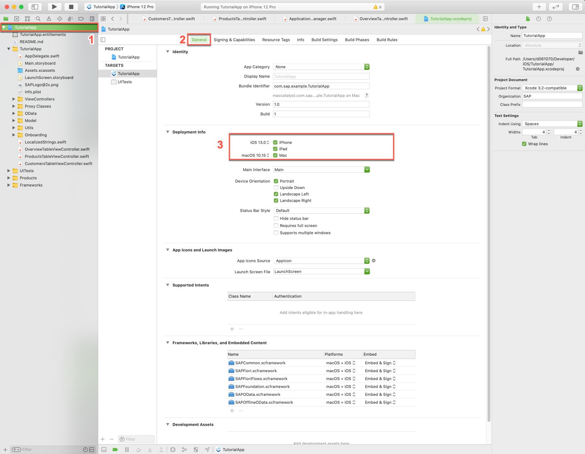
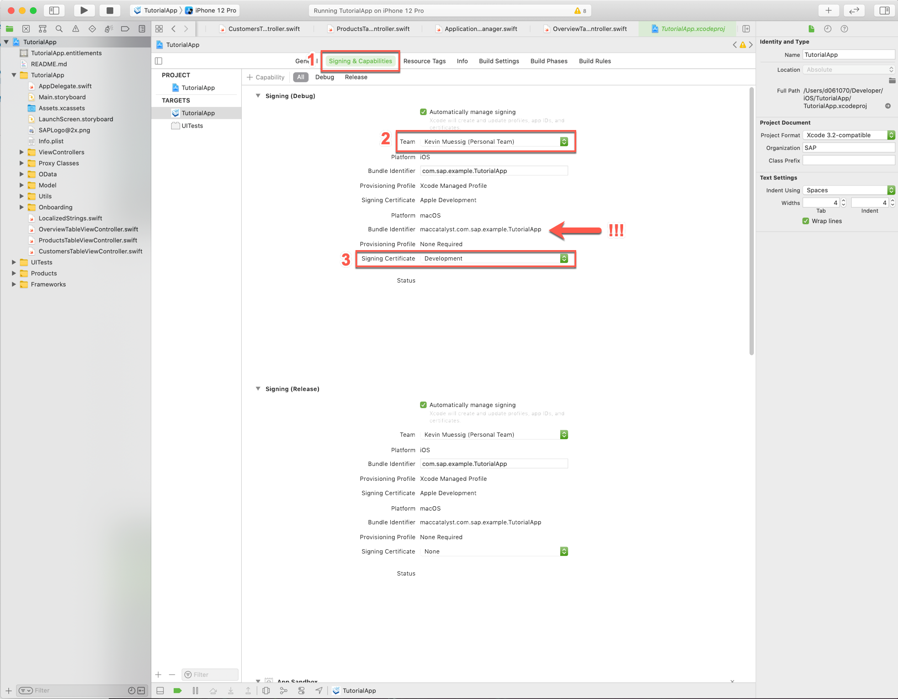
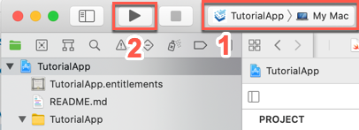

## Prerequisites
- **Development environment:** Apple Mac running macOS Catalina or higher with Xcode 11 or higher
- **SAP Cloud Platform SDK for iOS:** Version 5.0 or higher

## Details
### You will learn  
  - What is Mac Catalyst
  - What you should consider before transforming your app in a Mac Catalyst ready application
  - How to run your iPad app on MacOS

---

[ACCORDION-BEGIN [Step 1: ](What is Mac Catalyst)]

Mac Catalyst was introduced by Apple in 2019 during `WWDC`. Mac Catalyst allows you as a developer to transform your iPad app easily into a MacOS application. Mac Catalyst allows you to change your code to enable or disable certain features for MacOS. For example you can change certain UI elements to fit better on the MacOS platform or implement Menu Bar items and more.

Mac Catalyst combined a lot of the common frameworks and make them available to run both on MacOS as well as iOS, e.g. Foundation.

The big difference is that the underlying UI technologies remained separated on MacOS (`AppKit`) as well as on iOS (`UIKit`). What Mac Catalyst allows you to do is run `UIKit` on MacOS which allows your iPad ready app to run on Mac.

> If you're interested in Mac Catalyst in more detail, please visit [Bring Your iPad App to Mac](https://developer.apple.com/mac-catalyst/)

[DONE]
[ACCORDION-END]

[ACCORDION-BEGIN [Step 2: ](What to consider before using Mac Catalyst)]

Before you transform your app into a MacOS ready app through Mac Catalyst, you should consider if your app is actually suitable for a MacOS application:

- You should definitely familiarize yourself with the Human Interface Guidelines for [Mac Catalyst](https://developer.apple.com/design/human-interface-guidelines/ios/overview/mac-catalyst/).
- Also think about if you're using features which are not available on Mac Catalyst like `ARKit`.
- Think about your Use Case of the iPad app and think about if that app would make sense on Mac.
- If you already have a well maintained MacOS application released you should think twice if it is helpful to replace it with you iOS app.

[DONE]
[ACCORDION-END]

[ACCORDION-BEGIN [Step 3: ](What you get free when enabling your iPad-ready app for Mac)]

The great thing when you transform your app with Mac Catalyst is that Apple gives you a lot of things for free! Not only the platform frameworks, databases as well as services but also the following:

- Functional default menu bar
- Window management including
  - Window resizing
  - Full screen mode
  - Split view support
  - [Sidecar](https://support.apple.com/en-us/HT210380)
  - Dark Mode support
  - Mac Scrollbars with full interaction support
  - Scroll support while inactive window
  - Using a settings bundle will automatically give you a settings menu

If you want more information about Mac Catalyst you can always visit the following resources:
- [Mac Catalyst Developer Guide](https://developer.apple.com/documentation/uikit/mac_catalyst)
- [iPad Apps for Mac - WWDC Videos](https://developer.apple.com/videos/all-videos/?q=iPad%20Apps%20for%20Mac)

[DONE]
[ACCORDION-END]

[ACCORDION-BEGIN [Step 4: ](Make your app Mac ready)]

Before you do the necessary steps to make our app Mac ready let's take a look on how the app is going to look like on all three platforms.

!

You can see that you're going to change the appearance on MacOS to a split view having a side bar.

1. In your Xcode project click on the `TutorialApp.xcproj` file located in the project navigator and make sure that **Mac** is selected in the **Deployment Info** section.

    !

2. Click on **Signing & Capabilities** tab and select your **Team**, and **Signing Certificate**. You can also see that the **Bundle Identifier** changed using a new prefix `maccatalyst` to identify a Mac Catalyst app.

    !

    That is all you have to do.

3. Run the app now on `MacOS` choosing the **My Mac** scheme.

    !

[VALIDATE_4]
[ACCORDION-END]
