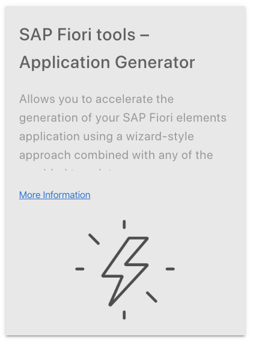
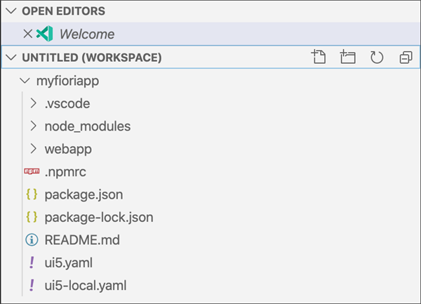
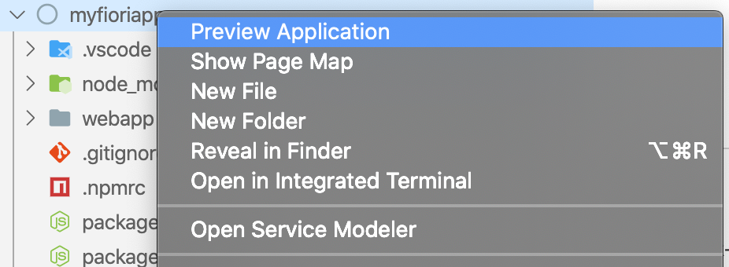

## Prerequisites
 - You must have access to the Gateway Demo System. This tutorial shows you how to access it: [Create an Account on the Gateway Demo System](gateway-demo-signup)
 - You must be able to access the following OData service URL (ES5 service): `https://sapes5.sapdevcenter.com/sap/opu/odata/sap/SEPMRA_PROD_MAN/`
 - You must have Visual Studio Code and SAP Fiori tools installed.

## Details
### You will learn
- How to generate an SAP Fiori elements application with SAP Fiori tools
- How to test run your application using both mock data and real data

The purpose of this tutorial is to familiarize you with the process for creating applications using the SAP Fiori tools Application Generator, as well as the process for testing your application with both mock and real data.

In this case, you will create an SAP Fiori elements list report page displaying a list of products. This list report will be modified in later tutorials using the other extensions available in SAP Fiori tools.

---

[ACCORDION-BEGIN [Step 1: ](Launch Application Generator)]

SAP Fiori tools includes an Application Generator that provides a wizard-style approach for creating applications based on SAP Fiori elements page types. You are going to use it to create your List Report Object Page app.

In Visual Studio Code, open the Command Palette using **CMD/CTRL + Shift + P**, type **`Application Generator`**, and select **SAP Fiori tools - Application Generator: Launch**.

!

>In Visual Studio Code, the **Command Palette** provides convenient access to a variety of commands. These commands give you access to certain functionality in Visual Studio Code, including the custom commands that are part of SAP Fiori tools.

[DONE]
[ACCORDION-END]

[ACCORDION-BEGIN [Step 2: ](Select application template)]

The **Command Palette** will then close and a new tab will open. Select the **SAP Fiori tools - Application Generator** tile and press **Next**.

!

You need to select the page type to create. Since this tutorial involves a list report, select **List Report Object Page**, and then click **Next**.

[DONE]
[ACCORDION-END]


[ACCORDION-BEGIN [Step 3: ](Configure service for List Report Object Page)]

With the page type selected, it is time to connect a data source. You will use the OData service mentioned in the prerequisite section of this tutorial.

Select **Connect to an OData Service** from the dropdown menu. A field to enter the OData service URL will appear. Copy and paste the service URL:

```
https://sapes5.sapdevcenter.com/sap/opu/odata/sap/SEPMRA_PROD_MAN/
```

You may be prompted to enter credentials to access the service. Enter your username and password, and click the **Next** button.


>These credentials were the ones you created if you had to request access to the OData service.

After successfully connecting to the supplied OData service,  click **Next** to customize the template.

Two more fields will appear. One for the **Main Entity** and another for the **Navigation Entity**. Since this list report is intended to display products, select `SEPMRA_C_PD_Product` for **Main Entity**. The application is simply meant to display a list of products, so set the **Navigation Entity** to **`None`**.

Click  **Next**.

[DONE]
[ACCORDION-END]

[ACCORDION-BEGIN [Step 4: ](Configure the main project attributes)]

With the page type and data source defined, the next step is to configure the main project attributes:


|  Field Name     | Value
|  :------------- | :-------------
|  **What is the module name for your application?**           | **`myfioriapp`**
|  **What is the title for your application?**           | **`Manage Products`**
|  **What is the namespace for your application?**    | **`Namespace1`**
|  **What is the description for your application?**          | **`Fiori elements application for managing Products`**
|  **Choose your project folder**   | Click the folder selection icon and select where to save your project.

Click **Finish**.

At this point, your application folder will be generated based on the input from above.

Once your project has been generated, you will have the option to add it to your existing workspace. Verify that your project has been created and it looks similar to this:

!

[DONE]
[ACCORDION-END]

[ACCORDION-BEGIN [Step 5: ](Preview app with real backend data)]

Since the given OData service came with pre-configured backend annotations, you can preview your app right away.

From the Visual Studio Code **Explorer** on your left, right-click your project and select **Preview Application**.

!

From the options, you will need to select a npm script. Select `start` and press **`Enter`** to preview your app with backend data. A new browser window will open with your List Report Object Page application running.

!

[DONE]
[ACCORDION-END]

[ACCORDION-BEGIN [Step 6: ](Preview your application with mock Data)]

During your app development, you may face a slow internet connection or an unavailable backend system. SAP Fiori tools provides the option to run your application with mock data.

From the Visual Studio Code **Explorer** on your left, right-click your project and select **Preview Application**.

From the options, you would need to select a npm script. Select `start-mock` and press **`Enter`** to preview your app with mock data.

!

A new browser window opens with your List Report Object Page application running with mock data. You may now close this browser tab since you have another tab from the previous step which is running your application with real data.

>For the remainder of this tutorial group, if the backend service becomes unavailable at any point, you can preview your application with mock data.

At this point, you should have the following:

- A List Report Object Page Fiori elements project generated by the SAP Fiori tools Application Generator

- A running application using real backend data

Good job! In the next tutorial, you will enhance the functionality of this application by configuring the List Report Page using SAP Fiori tools.

[VALIDATE_3]
[ACCORDION-END]
