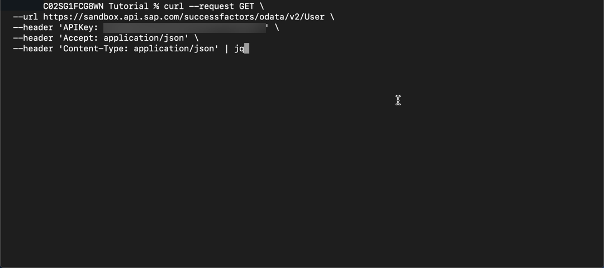
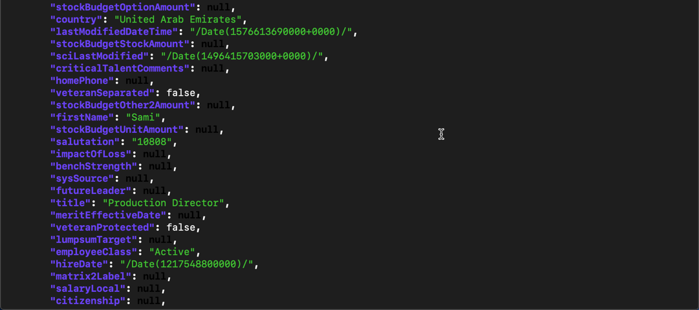
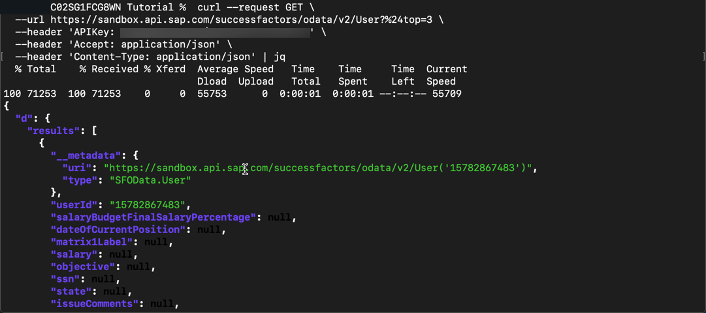
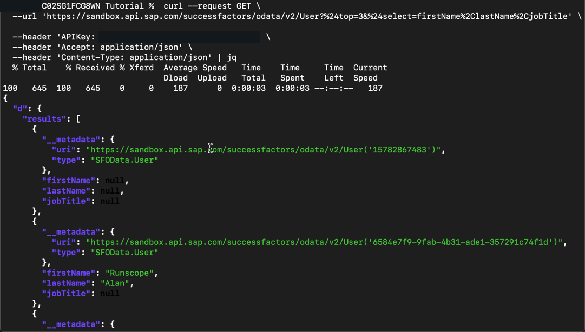

## Prerequisites  
 - Make sure you have the command line tools Curl and jq installed.
 - Windows instructions: [Curl](https://chocolatey.org/packages/Curl) and [jq ](https://chocolatey.org/packages/jq)
 - MacOS/Unix instructions: [jq ](https://stedolan.github.io/jq/download/) (Curl should already be available)

## Details
### You will learn  
You have already discovered what the API Business Hub is and learned how to test it on the website. In this tutorial, you will learn how to use command line tools like Curl and jq to test REST APIs locally on your machine.

---

[ACCORDION-BEGIN [Step : ](Navigate to the User Management API)]

If you ever need to get back to the [SAP API Business Hub](https://api.sap.com/) and can't remember how to get there from SAP Cloud Platform, you can always just go to <https://api.sap.com>.

For this tutorial, you can go straight to the [user management page](https://api.sap.com/api/PLTUserManagement/resource).

[DONE]
[ACCORDION-END]
[ACCORDION-BEGIN [Step : ](Generate sample API call code)]

In the tab **API References**, find the `GET /User` method. The SAP API Business Hub provides you with some starter code in a variety of languages and tools for each API. Click the **Generate Code** link at the top of the method definition.


A pop-up window will appear. The API call starter code is available in a couple different languages like JavaScript and Swift. You will be using the Curl code in the this example.

Select **Curl** and then **copy** the highlighted text in the clipboard. This personalized snippet already includes your unique API key.


[DONE]
[ACCORDION-END]
[ACCORDION-BEGIN [Step : ](Run sample API call code)]

Paste the content of the clipboard in a terminal or command line window.
Hit **Enter** to run the command. It may take a few seconds before data is seen on your screen. If this is successful, it will return a data set of about 650 users.
> You can use `CTRL+C` to stop the command from running.

You'll notice that the output is not formatted. For this, you can pipe the output of Curl to jq to format it nicely.






[DONE]
[ACCORDION-END]
[ACCORDION-BEGIN [Step : ](Limit the number of results)]
Do you remember the parameters you set when testing in the API Business Hub? Try adding in the `$top` parameter here. It's a good thing to note that `$` is not allowed in a URL and can be encoded with `%24`. This changes the second line of the command to.
```Shell
--url https://sandbox.api.sap.com/successfactors/odata/v2/User?%24top=3 \
```

After your command line prints out 3 results, it should stop running.



> If you get a *Curl: no match* error, try wrapping your URL in single quotes.

> It may be easier to make edits to your Curl code in the text editor rather than directly in the command line.

[DONE]
[ACCORDION-END]
[ACCORDION-BEGIN [Step : ](Add multiple parameters to the API call)]
Besides the `$top` parameter, you can add multiple parameters to the [Query String](https://en.wikipedia.org/wiki/Query_string) of your API call.
Now add in the 2nd parameter for `$select`. You only want the `firstName`, `lastName`, and `jobTitle` for the top 3 users. You can delaminate values in the select array using a comma(,). However, a comma is not a character allowed in a URL. The ASCII encoded value is `%2C`.

This changes the second line of the command to.
```Shell
--url 'https://sandbox.api.sap.com/successfactors/odata/v2/User?%24top=3&%24select=firstName%2ClastName%2CjobTitle' \
```

> The `&` character indicates to the command line that a new command in coming. You need the command line to interpret the `&` as part of the URL. To do so, **you need to add single quotes(') around the URL**.

**Run** the assembled command in the terminal.




[VALIDATE_5]
[ACCORDION-END]
