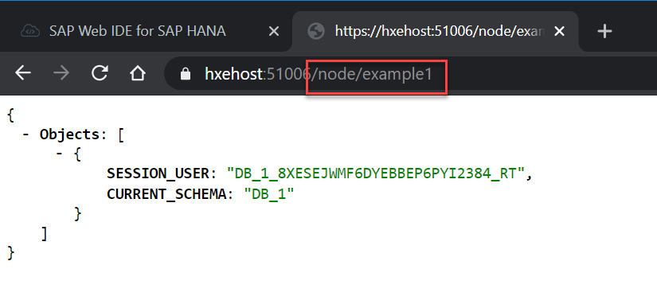

## Prerequisites  
- **Proficiency:** Intermediate
- **Tutorials:** [SAP HANA XS Advanced - Modules within Node.js SAP HANA applications](https://developers.sap.com/tutorials/xsa-node-modules.html)

## Next Steps
- [Asynchronous Non-Blocking I/O](https://developers.sap.com/tutorials/xsa-node-async.html)

## Details
### You will learn  
Learn how to connect to the SAP HANA database using Node.js and the HANA database library, `@sap/hdbext`.


### Time to Complete
**15 Min**.

---


[ACCORDION-BEGIN [Step 1: ](Add handler for new example request)]
In the [previous tutorial](https://developers.sap.com/tutorials/xsa-node-modules.html), you added a handler for a path called `/node` by modifying the files `myNode.js`.

Add a new route for `example1` in `myNode.js` to get the database `connection/client` from the express request object (`req.db`). Then create a prepared statement for the SELECT of `SESSION_USER` from dummy (dummy is the synonym created in the initial [HDI tutorial](https://developers.sap.com/tutorials/xsa-hdi-module.html)). Execute the statement and send the results as JSON in the response object.


```javascript

//Simple Database Select - In-line Callbacks
//Example1 handler
app.get("/example1", (req, res) => {
	let client = req.db;
	client.prepare(
		`SELECT SESSION_USER, CURRENT_SCHEMA
									 FROM "DUMMY"`,
		(err, statement) => {
			if (err) {
				return res.type("text/plain").status(500).send(`ERROR: ${err.toString()}`);
			}
			statement.exec([],
				(err, results) => {
					if (err) {
						return res.type("text/plain").status(500).send(`ERROR: ${err.toString()}`);
					} else {
						var result = JSON.stringify({
							Objects: results
						});
						return res.type("application/json").status(200).send(result);
					}
				});
			return null;
		});
	return null;
});


```

As follows:


[DONE]

[ACCORDION-END]

[ACCORDION-BEGIN [Step 2: ](Run the node and web modules)]

Run the node and web modules. You should see that the build and deploy are successful. Call the **`example1`** script by changing the web tab




You can see the **`SESSION_USER`** returned by the SELECT statement.

[DONE]

[ACCORDION-END]

[ACCORDION-BEGIN [Step 3: ](Use the async module to access the database)]

The default programming approach in Node.js is using callbacks/event handlers. This is because even the different parts of a database request (connection, prepared statement, execution, etc) are all non-blocking operations.

>Hint: A callback is an asynchronous operation that gets executed after another one notifies completion.  

Add a second route handler, called `example2`, that uses the `async` module:

```javascript
var async = require("async");
//Simple Database Select Via Client Wrapper/Middelware - Async Waterfall
app.get("/example2", (req, res) => {
	let client = req.db;
	async.waterfall([
		function prepare(callback) {
			client.prepare(`SELECT SESSION_USER, CURRENT_SCHEMA
											FROM "DUMMY"`,
				(err, statement) => {
					callback(null, err, statement);
				});
		},

		function execute(err, statement, callback) {
			statement.exec([], (execErr, results) => {
				callback(null, execErr, results);
			});
		},
		function response(err, results, callback) {
			if (err) {
				res.type("text/plain").status(500).send(`ERROR: ${err.toString()}`);
			} else {
				var result = JSON.stringify({
					Objects: results
				});
				res.type("application/json").status(200).send(result);
			}
			return callback();
		}
	]);
});
```  

Take a look at both newly-added examples. You can easily notice that the second one is easier to read, although the runtime does not change. You can check for more information on the `async` module  in the [`async` documentation](https://caolan.github.io/async/).

[DONE]

[ACCORDION-END]
