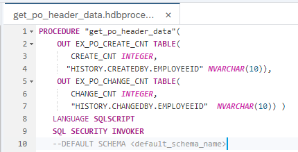
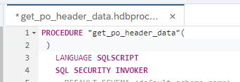
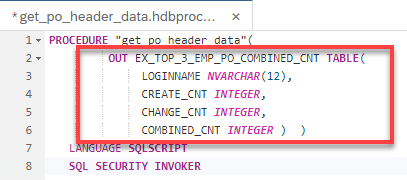
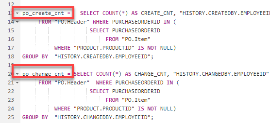
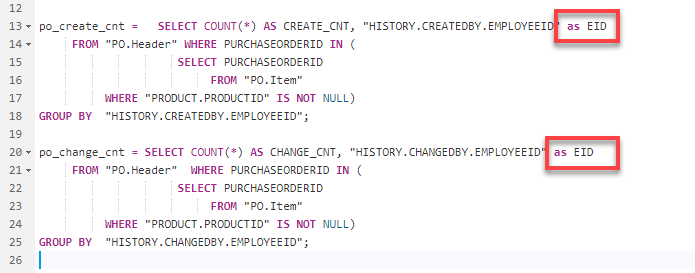
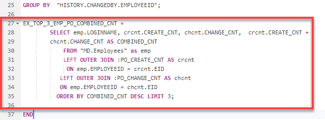
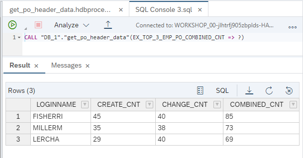

## Prerequisites  
- **Tutorials:** [Parallel Processing and Parameters](xsa-sqlscript-parallel)

## Details
### You will learn  
In this exercise you will modify the code of procedure `get_po_header_data` again to use a single tabular output. Existing queries will be reused based on intermediate table variables.

---

[ACCORDION-BEGIN [Step 1: ](Edit Previous Procedure)]

Return to your procedure called `get_po_header_data`.



Delete the output parameters which you defined in the last section.



[DONE]
[ACCORDION-END]

[ACCORDION-BEGIN [Step 2: ](Define New Output Parameter)]

Define a new output parameter as shown




[DONE]
[ACCORDION-END]
[ACCORDION-BEGIN [Step 3: ](Rename Variables)]

Rename `EX_PO_CREATE_CNT` to `PO_CREATE_CNT`. Also rename `EX_PO_CHANGE_CNT` to `PO_CHANGE_CNT`




[DONE]
[ACCORDION-END]

[ACCORDION-BEGIN [Step 4: ](Edit SELECT Statements)]

Modify the two SELECT statements and add `AS EID` after the `EMPLOYEEID` field.




[DONE]
[ACCORDION-END]

[ACCORDION-BEGIN [Step 5: ](Add SELECT Statement)]

Next, add another SELECT statement after the 2 previous SELECT statements as shown. This statement uses the previously defined table variables.



[DONE]
[ACCORDION-END]

[ACCORDION-BEGIN [Step 6: ](Check Complete Code)]

The completed code should be very similar to this.

```
PROCEDURE "get_po_header_data"(
         OUT EX_TOP_3_EMP_PO_COMBINED_CNT TABLE(
              LOGINNAME NVARCHAR(12),
              CREATE_CNT INTEGER,
              CHANGE_CNT INTEGER,
              COMBINED_CNT INTEGER )  )  
   LANGUAGE SQLSCRIPT
   SQL SECURITY INVOKER
   --DEFAULT SCHEMA <default_schema_name>
   READS SQL DATA AS
BEGIN

po_create_cnt =   SELECT COUNT(*) AS CREATE_CNT, "HISTORY.CREATEDBY.EMPLOYEEID" as EID
     FROM "PO.Header" WHERE PURCHASEORDERID IN (
                     SELECT PURCHASEORDERID
                          FROM "PO.Item"
          WHERE "PRODUCT.PRODUCTID" IS NOT NULL)
GROUP BY  "HISTORY.CREATEDBY.EMPLOYEEID";

po_change_cnt = SELECT COUNT(*) AS CHANGE_CNT, "HISTORY.CHANGEDBY.EMPLOYEEID" as EID
     FROM "PO.Header"  WHERE PURCHASEORDERID IN (
                     SELECT PURCHASEORDERID
                          FROM "PO.Item"
          WHERE "PRODUCT.PRODUCTID" IS NOT NULL)
GROUP BY  "HISTORY.CHANGEDBY.EMPLOYEEID";

EX_TOP_3_EMP_PO_COMBINED_CNT =
        SELECT emp.LOGINNAME, crcnt.CREATE_CNT, chcnt.CHANGE_CNT,  crcnt.CREATE_CNT +
        chcnt.CHANGE_CNT AS COMBINED_CNT
            FROM "MD.Employees" as emp
            LEFT OUTER JOIN :PO_CREATE_CNT AS crcnt
             ON emp.EMPLOYEEID = crcnt.EID
           LEFT OUTER JOIN :PO_CHANGE_CNT AS chcnt
           ON emp.EMPLOYEEID = chcnt.EID
          ORDER BY COMBINED_CNT DESC LIMIT 3;

END

```


[DONE]
[ACCORDION-END]

[ACCORDION-BEGIN [Step 7: ](Save and Build)]

Save the procedure.  Use what you have learned already and perform a build on your `hdb` module.


[DONE]
[ACCORDION-END]

[ACCORDION-BEGIN [Step 8: ](Run and View Results)]

Return to the Database Explorer page and use what you have learned and generate a new call statement for the procedure and run it.

The results are then shown.




[DONE]
[ACCORDION-END]
